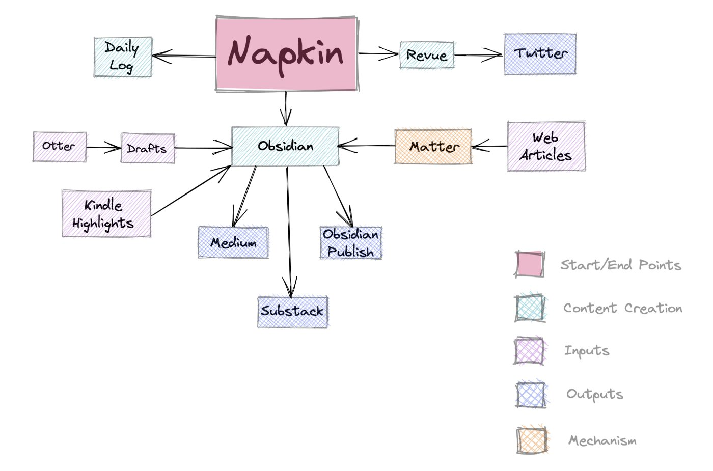

- Logseq For knowledge Management
  collapsed:: true
	- logseq folder structure
		- Logseq  refers to root folder as a graph
		  collapsed:: true
			- when you open a folder it creates
				- pages -> for pages
				- journal -> for daily journal pages
				- folder for custom css and other configs
	- blocks for thinking
	  collapsed:: true
		- Logseq stores knolwedge as a tree of blocks
			- each block has its reference id and can be atomic
			- each block can also have its own sub block
				- this is good to store knowledge in a linear structure.
					- And since blocks are atmoic, they can also be referred from inside other blocks and pages to form better structures
					-
					-
	- Native journal pages
		- can serve as inbox as well as a brain dump before you begin your work. Can be tied to habits
- Today's task
	- [ ] React key concepts
	- [ ]
- [[Freelancing Lessons]]
  collapsed:: true
	-
- [[The Decision Book]]
- Today's Newsletter reading
  collapsed:: true
	- Rather than seeing items as objects, see them as magnets for your attention. Each object gently pulls a certain amount of your attention toward it. -> james clear on designing your environment
	- "Powerful combination = Hate being bad at stuff + Willing to look like a beginner.
- Get better at terminal and learn warp.dev then conduct sessions to teach
- monitor specs
  collapsed:: true
	- 27 best. Min 24
	- 1440p
	- ips or mini led
	-
- How I use a daily log to write more
	- Nicola Fisher [original](https://medium.com/@nicolafisherwriter/how-i-use-a-daily-log-to-write-more-cd4a7434ee2e?source=explore---------7-98--------------------34b642df_17b9_4081_b916_112030b8cf93-------15---&utm_source=pocket_mylist)
	- Until April 2021, my writing was going nowhere. My jottings were for my consumption alone, a handful of newsletter subscribers or for a minuscule number of blog readers.
	- The best way for me to start has always been with visuals. Since my mid twenties when there was a whiteboard and magnetic hexagons in the office, I’ve planned projects by moving pieces around.
	- Over the years, Post-Its on my study wall managed my client interactions, taking them through a lifecycle.
	- Despite loving tech, my fallback is paper. Moving around tiny squares clarifies my thinking. I’ve mapped my book content the same way
	- Once mapping is done, I transfer everything to Obsidian. Each Post-It becomes a note, each one a distinct topic or theme.
	- Napkin is an app designed to build a network of thoughts. This network grows and develops as you add to it, and magically connects them, their themes and concepts.
	  collapsed:: true
		- I can add my own thoughts or link to public Napkins of others. I can see where ideas overlap, I can be inspired by someone else’s thinking.
		- Over time, Napkin takes on a life of its own, presenting you daily with, what I call, the thought for the day. It takes you down rabbit holes and off at tangents.
	- 
	- On Mondays (headline day), I dip into Napkin to choose the ideas to include in my content plan. These will form the outline of posts I write for Medium, Substack, and my newsletter.
	- Weekends work well for idea capture. Although I add thoughts to Napkin daily, I spend time on a Saturday actively logging my notes.
	- I’m always on the look out for new ideas. I record snippets of conversation. I create character outlines based on people I meet or overhear. It’s all grist to the mill.
	- For the first time I have five weeks of content planned. Now all I have to do is get writing!
	-
- makers vs managers schedule [original](http://www.paulgraham.com/makersschedule.html?utm_source=pocket_mylist)
	- like programmers and writers. They generally prefer to use time in units of half a day at least. You can't write or program well in units of an hour. That's barely enough time to get started.
	- When you're operating on the maker's schedule, meetings are a disaster. A single meeting can blow a whole afternoon, by breaking it into two pieces each too small to do anything hard in.
	- For someone on the maker's schedule, having a meeting is like throwing an exception. It doesn't merely cause you to switch from one task to another; it changes the mode in which you work.
	- A meeting commonly blows at least half a day, by breaking up a morning or afternoon. But in addition there's sometimes a cascading effect.
		- If I know the afternoon is going to be broken up, I'm slightly less likely to start something ambitious in the morning. I know this may sound oversensitive, but if you're a maker, think of your own case. Don't your spirits rise at the thought of having an entire day free to work, with no appointments at all?
		- ambitious projects are by definition close to the limits of your capacity. A small decrease in morale is enough to kill them off.
		- Each type of schedule works fine by itself. Problems arise when they meet. Since most powerful people operate on the manager's schedule, they're in a position to make everyone resonate at their frequency if they want to.
			- When we were working on our own startup, back in the 90s, I evolved another trick for partitioning the day. I used to program from dinner till about 3 am every day, because at night no one could interrupt me. Then I'd sleep till about 11 am, and come in and work until dinner on what I called "business stuff." I never thought of it in these terms, but in effect I had two workdays each day, one on the manager's schedule and one on the maker's.
				- how can I structure [[my daily schedule]] accordingly ?
				- That’s because I use an AI assistant powered by [Clara Labs](https://claralabs.com/) to help manage my external calendar
				- Make in the morning. Studies have shown that your most productive hours are in the morning (usually from 10am-noon), and so these are the hours when you should focus on the hardest mental tasks of making. Ideally, you would not even check your email until this time is over, lest you find yourself wasting this precious time on communications. (See Going the Distance).
				- Meet in the afternoon. Lunch is an inherently social experience in our culture and you should take advantage of it, and the time after it, to meet and gather feedback. This will help you overcome the afternoon lull that would hit you sitting (or standing) at your desk trying to make.
				-
	-
	-