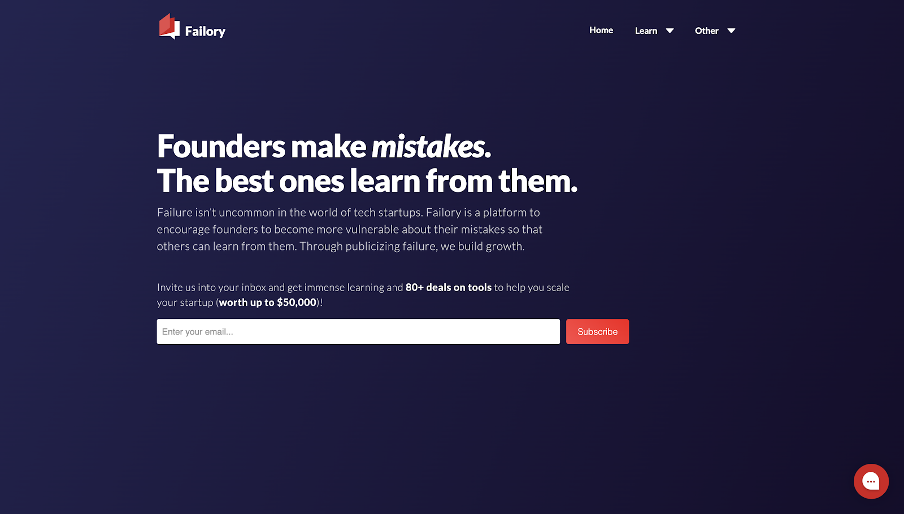
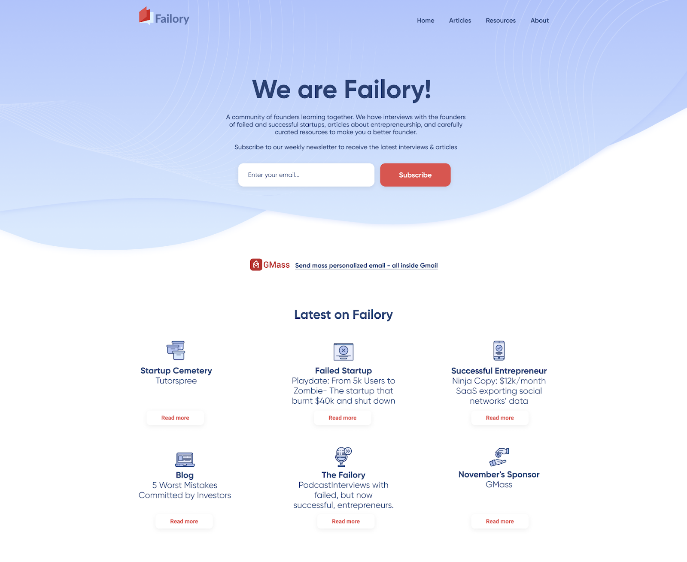
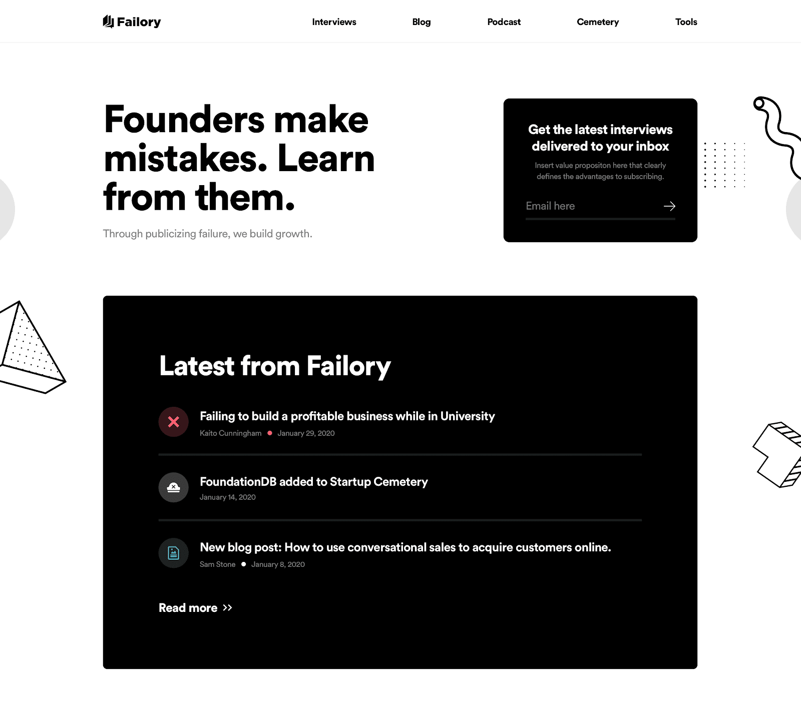

- Designjoy -> design as a service
  collapsed:: true
  id:: 6285ebef-c151-4b7b-aa1c-f9cda6659a1b
	- https://www.designjoy.co/
	- [review](https://www.failory.com/blog/designjoy-review)
		- It’s like Netflix for design. Instead of paying $12.99 and getting access to movies, you pay $2,499 or $2,999 and you get access to a designer that gets your requests done.
		- They basically are agencies that get any design task you need at a fixed price per month. While a freelancer or agency charges per project and each task, unlimited design services are paid once a month / year and it doesn’t matter if you requested any tasks or not.
		- These services tend to limit the amount of work they do at the same time. DesignJoy, for example, does one concurrent task.
		- If you’re looking for a specific task to be done, unlimited design services might not be the best fit. However, those entrepreneurs running digital businesses may know that there are hundreds (or “unlimited”!) of things design-related that could be worked/improved. That’s why these services exist.
		- They basically do any kind of design task, but the hardest ones, such as website & app design, logos & branding, and presentation decks are only available in the Pro plan.
		- [figma page](https://www.figma.com/proto/xMf3kagAMyUSNulcEMNUAU/Sample-Work?page-id=0%3A1&node-id=1%3A2&viewport=252%2C48%2C0.25&scaling=min-zoom&starting-point-node-id=1%3A2)
		- revision comparison => mvp -> freelancer -> designjoy
		  collapsed:: true
			- 
			- 
			- 
			-
		- DesignJoy’s pricing is super simple. There only are three packages: Design for $2,499/mo, Design + Webflow for $2,999/mo and Enterprise with a custom pricing.
		- Note that you can add collaboration through Slack to any of the other plans by paying an additional of $249/mo
		- think they generally design on Sketch and upload to Invision so that the user can comment directly on the layout.
		- **To manage communication, they have built an internal tool within Trello where you are able to add requests, request them to work on them, review the delivered work, etc. They have a system of notifications which makes it super easy to be updated on how the design is going**
		- As for times, they promise to get the work delivered in less than 48 hours (weekdays only). In my case, as it was a whole website (+25 pages) redesign, it took them one whole month.
		- To be safe, I contacted Brett and we talked about the project for some minutes. He shared with me more of his previous work and claimed they were going to be able to finish the whole website redesign in 1 month.
		- **We also agreed to spend the first 7 days, in which they are willing to give you the money back if you’re not happy with the results, working on the main pages, such as the homepage. After the first week, I was super happy with the direction taken so I obviously kept with DesignJoy.**
		- nEGATIVES
			- There were some times in which I didn’t hear back from DesignJoy for 2-3 days. Anyway, it’s super normal. I was quite an obsessive customer, particularly because I had lost 4 months with the previous designer.
			- There were some comments on the Invision that they forgot to change. They were all minor changes, so no big deal.
			- used their site’s chatbot to directly communicate with them. It made it quite tedious as I had to enter the site, send a message, wait until they connected, etc.
			- If you don’t request any design task, you still have to pay. You need to be sure you will have many simple or few complex design tasks.
			- t’s a little bit expensive for many small/medium businesses. Some other unlimited design services charge far less, but that has a direct relationship with the quality of the designs.
		-
- How to delegate
	- [like a millionaire](https://www.youtube.com/watch?v=YzNwTk4sWwE)
	- Delegate up
		- Buy expertise
	- free up time to use on more effective skills
	- just bcz u r best at it does not mean u do it
	- u will be judge by how you teach
	- dont ask fish to climb a tree
	- inspect until you trust
	- be a leader, not a doer of all
	- what can you not delegate ?
		- high level skill
		-
-