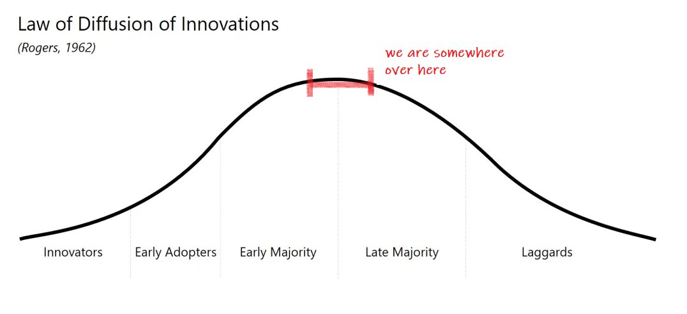

- Solana & rust
  collapsed:: true
	- Webassembly rust
	- web3
	- resources for learning rust
	  collapsed:: true
		- [24 days of rust](http://zsiciarz.github.io/24daysofrust/book/vol1/day1.html)
		- https://www.rust-lang.org/learn
		- rustlings cli course
		-
	- [exosystem](https://solana.com/ecosystem)
	- jobs
	  collapsed:: true
		- jobs.solana.com
		- stream flow
		  collapsed:: true
			- [frontend engineer](https://streamflow.notion.site/Frontend-engineer-Full-time-Remote-d735dbf5111c4193969c8f73768ba320)
				- react component skills
				- making npm package
		- neon labs
		  collapsed:: true
			- [tech writer](https://jobs.solana.com/companies/neon-labs/jobs/6127021-technical-writer#content)
			- Oversee strategy, creation, and execution of thought-leadership content
			- Create and maintain technical documentation for Neon EVM
			- working closely with the technical and marketing teams Write about complex technical topics in a way that a less technical audience can digest
			- Comfort with Medium and active on Twitter Demonstrated ability to engage with the crypto community and varying audiences on technical subjects Passion for learning about blockchain and various web3 verticals Use creativity and judgement towards professional, technical, or operational problems Demonstrated people skills that contribute to an open and collaborative environment Excellent English communication skills
			- **Ability to collect, summarize, and analyze metrics to measure content performance and audience engagement **
			-
		- aurory
			- [react dev](https://jobs.solana.com/companies/aurory/jobs/13970673-frontend-react-developer#content)
			- You are passionate about programming and you love working on your side projects in your free time. You are always building something and have an entrepreneur/startup mindset.
			- As a professional developer, you have a track record of projects development using some or all of the following technologies
				- react
				- ts
				- solana web3
			-
	- strategy
	  collapsed:: true
		- apply to content writer on firday after generating content plan
		- article on where to learn web3
		- learn blockchain and dapp for 6 months -> paid ? ztm ? udacity ?
		- finish pm nanodegree for product role
		-
- product mgmt reading from pocket
  collapsed:: true
	- [Growing into product management. My 4 years of mistakes and learning](https://medium.com/@praveennatarajan/growing-into-product-management-my-4-years-of-mistakes-and-learning-1fd34156fdbf?source=explore---------21-98--------------------83b82c50_c7d8_4ee5_b4d6_2624a7dadb47-------15&utm_source=pocket_mylist)
		- prob 1 : understanding customers
			- read [this book](http://www.whencoffeeandkalecompete.com/) on jobs to be done framework
		- prob 2 prioritization -> design thinking and sprint
		- prob 3 team friction
		- prob 4 : issue tacing and tracking
		- prob 5 : product vision
	- [The ending of Product Management](https://medium.com/@anfonn/the-ending-of-product-management-40153938154d?source=explore---------84-98--------------------d42c3361_d553_42ee_b501_1cbdae127252-------15&utm_source=pocket_mylist)
		- where we are
		  collapsed:: true
			- 
			-
		- 3 factors of the end
		  collapsed:: true
			- inflation
			  collapsed:: true
				- When interest rates are high, the capital doesn’t need to take as much risk to receive payback, it can just chill at the bank. If the capital stays at the bank, startups lose their main source of income: investment. Without the hungry startups and their scale-up mindset, Product Culture as we know it receives a blow
			- metaverse and web3
				- With the decentralization of internet, the lines between customer and provider are blurred. In that same way, the metaverse blurs the line between physical and digital. We are at the threshold of a change in how we deal with… well, reality. It will be so intense that it’s impossible to predict the consequences. The only thing that is sure is that it will bring consequences.
			- everybody wants to becomne pm
				- people flock to the career in droves under promises of growth and high pays with relatively low effort. There can only be so much demand for so many people, and even worse, we are reproducing lessons from biases built on top of the original material. The updates to the craft are far slower then the expansion of the market.
				-
		- I believe we’ll settle on something in between. More demand for predictability, higher aversion to risk, less multidisciplinary teams, but shorter user feedbacks, less processes and more horizontal leadership.
		- I would definitely recommend that you broaden your horizons on the topic. People on the Product community tend to obsess over subject rather then substance some times. If you have the core values of Product Development truly at heart, changes will come and go and you’ll still be a good leader.
		- Remember to “listen” to the customer frequently (either by data or direct feedback), be sympathetic to either yours external or internal stakeholders, make more questions than answers and have the back of your teammates. This career will never end.
		-
- complete roadmap to pro frelancer
  collapsed:: true
	- develop freelancer mindser
	- choose your niche
	- define your services and ideal clients
	- portoflio
	- testimonials
	- how to charge
	  collapsed:: true
		- I ask for all the essential details about the project (and clarify what isn’t included). Then I break it down into small tasks and calculate how much time each task will take. Then I quote the price.
		-
	- you are your own accounts dept
	- unlock linkedin
	- build brand first 4 going full time
	-
- [[june projects]]
-