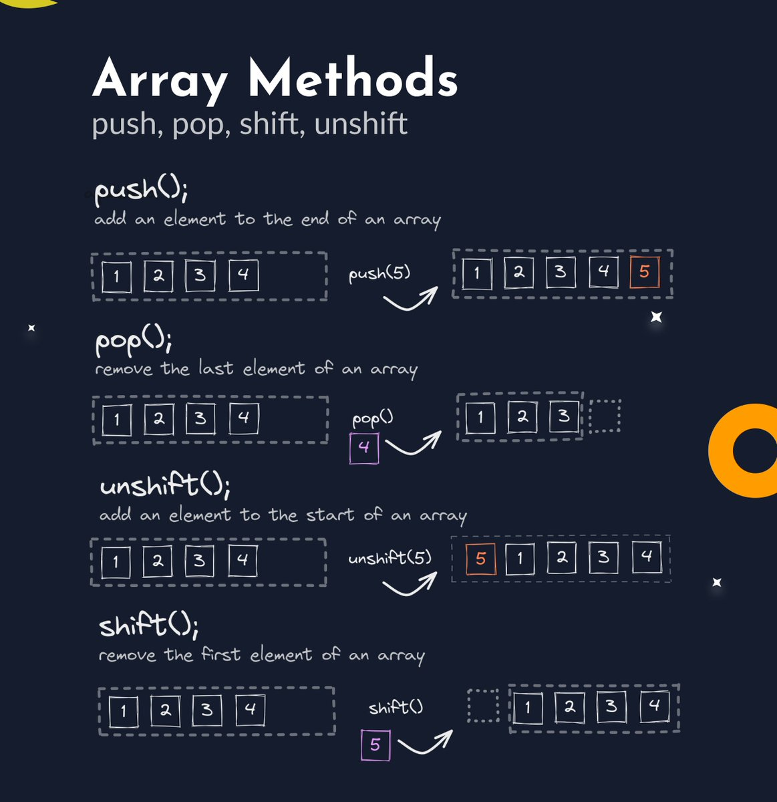
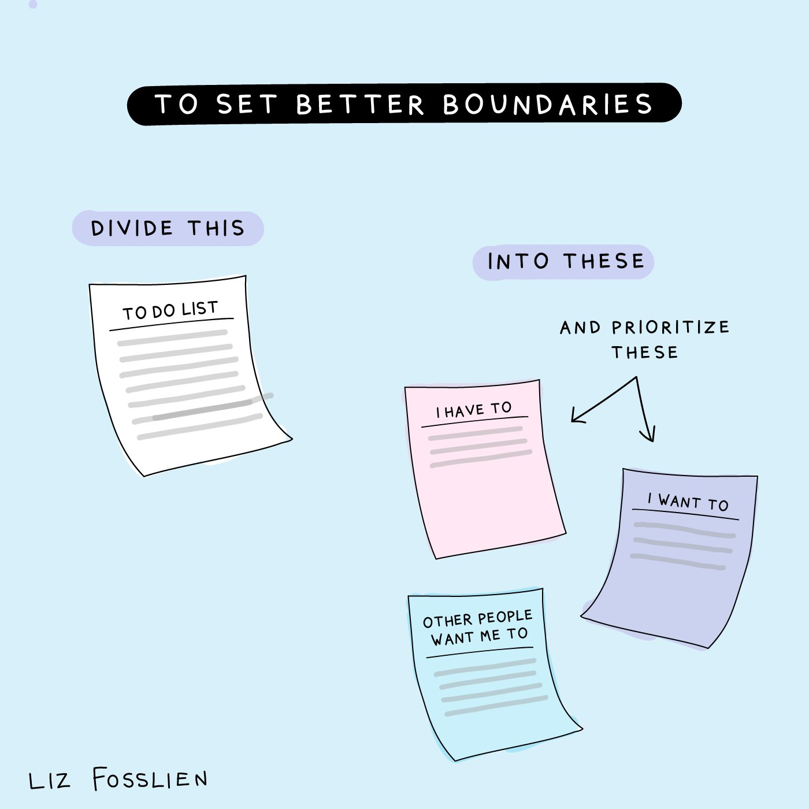

- Planetscale hashnode hackathon
	- PlanetScale is a database for developers, scalers, creators, optimists, builders, and enterprisers. It's a MySQL-compatible serverless database platform.
	- 5 grand przes $2000
	- 10 runner up $1k
	- criteria
		- prod thinking
		- ui ux
		- code qual
		- completeness of article
		- comprehensible
- array methods viz like this (for rust or sol ) ?
  collapsed:: true
	- 
- best advice for devs -> double down on strengths b4 putting all time in weaknesses
  collapsed:: true
	- u can bcm specialist faster or u can work to become mediocre before you try to improve further
	-
- separating crypto fiction and facts
	- [thread](https://twitter.com/MishadaVinci/status/1543593192439685122)
	- crypto crash -> product cycles evolve independently
	- web3 has no real use cases -> web3 will impact evcery aspect of how we think work and live
	- web3 is a fad -> already being adopted by the mainstream
	-
- https://www.manypixels.co/gallery design resources
- 
-