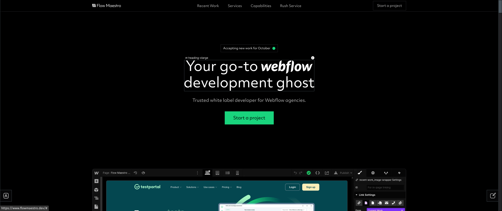
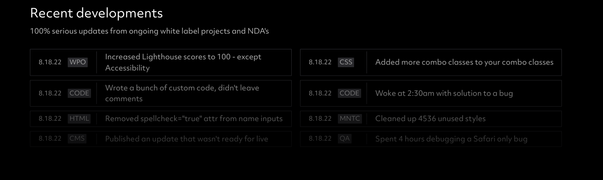

- react and tql points
- webflow and css points
- misc
	- company
	  collapsed:: true
		- something of my own -> labs
		- gives me a reason to wake up early
		- blog home
			- digital writing elsewhere
		-
	- [[Engineering Daybook]]
	- blockchain job search
		- was chasing. Instead should focus on getting good enough
	- web3 projects
		- https://presearch.io/
		- https://www.usebraintrust.com/how-it-works-for-talent
		- https://audius.co/
		- https://www.sigle.io/
		- https://www.arweave.org/
		-
	- nocode aditya
	- webflow agency competitor analysis
		- flow maestro
		  collapsed:: true
			- landing good animation to cover up hero
			  collapsed:: true
				- 
			- wip notifs
				-  -> redis ?
				- check out the process parts
				- copy and implement estimates section
					- 
					-
	- webflow vs custom side by side builds course
	-