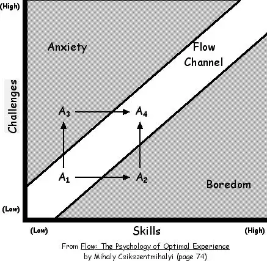

- https://www.nesswell.com/?ref=lapaninja ux case study also study font really good use of header
- https://www.symbolaudio.com/?ref=lapaninja color theme for leo
- https://www.tenzrhealth.com/?ref=lapaninja nehal case study
- create inspiration folder and save timeline ss https://textluke.com/?ref=lapaninja
- [how to learn react](https://www.robinwieruch.de/learn-react-js/)
	- Learn React, only React step-by-step, and don't let yourself be distracted by other tech on the journey.
	- JavaScript and React are evolving constantly as both innovate and want to stay relevant in the future; learn and keep up with them first before learning anything else.
	- No way, learn React first before converting JavaScript to a typed language. Mixing code typed with TypeScript in vanilla JavaScript and your React components will become a mess and overwhelming when you haven't learned React itself. Also, 99% of the React tutorials and courses out there are not written in TypeScript, making it harder to follow the basics of what you should be learning.
	- Learn React and its built-in state management first will cement the core of React can do before reaching out to a sophisticated external state management library meant to be used in large scale and complex applications. React comes with plenty of tools to handle state in your application(s). The vast majority of React applications don't need Redux or any other state management library. Learn to deal with React states before adding another library to the problem. Redux makes React more complicated for beginners.
	- You don't want to hang around in the "Scopes and Closures"-land while you could build real projects instead that motivate you to keep going. The "aha"-moment for grasping closures will come along the way. Personally I didn't know half of the things in the list when I started to learn React
	- I believe most of JavaScript can be learned along the way when learning React. Doing so allows you to experience it in context while building web applications. That's exciting and drives us as human beings. Keep yourself excited while learning and don't spend too long with the fundamentals not applying them in a real-world scenario. Start building real projects
	- As an alternative, try to migrate the code from jQuery to React as a learning opportunity. That's how I did it in my last job. I became a JavaScript developer in the early days of Angular, but never really had to learn to be proficient with jQuery. Instead I focused on the journey ahead with Angular which then became React.
	-
- [how to learn any framework](https://www.robinwieruch.de/how-to-learn-framework/)
	- get out of the analysis paralysis
		- It doesn't matter if you choose Vue, Angular or React, because they all solve the same problem. They enable you to build web applications. That's it. And believe it or not, if you mastered one of them, it's not too difficult to jump on another one if you have learned JavaScript properly.
	- You should master the core principles of JavaScript. Whether you take the bottom-up (JavaScript -> Framework) or top-down (Framework -> JavaScript) approach is up to your personal learning philosophy. What matters is that you understand JavaScript to move effortless from one to another library. It's not only applicable for React, Vue or Angular, but also for libraries such as Redux or MobX. When you move from one technology to the next, you will need to understand the underlying mechanisms. So just take your time to learn about these core principles:
	- strongly believe that students should narrow their learning material to pave their way of learning something more effortless. Therefore it doesn't help to purchase 10 courses on Udemy. It's a never-ending consumer story and you will actually never get your hands dirty by programming yourself. Again, there are plenty of stories on platforms where people are speaking about the same problem: they have watched all the video courses, but none stuck and they don't know how to start coding the thing they have watched for the last 30 hours.
	- if you have so much time to consume learning material, try to add diversity in it. Take one or maximum two video courses and supplement it with a book, a podcast and a real hands-on course with a coding playground to stimulate all senses. That's how I approached [learning about machine learning](https://www.robinwieruch.de/machine-learning-javascript-web-developers/) recently. If you are coding a personal project along the way, you should be able to keep the challenges ahead and your skills in balance. Eventually you will end up in a state of flow where it becomes a pleasure to apply your learnings in your project.
	- 
		- f you read these last paragraphs and you feel like you belong to this group of people consuming too much, the most important step for you is to start producing. I believe you have already consumed plenty of learning material by now, so sit down and start to code something with your chosen framework. If you get stuck, use your favorite search engine, ask questions on StackOverflow or join a Slack community to get help from others. It is also great to help others on these platforms. Teaching someone else is the best way to internalize the learnings.
		- Personally I never learned real coding from books. Books were great for me to understand broader principles. However, when I decided to write books about learning to code myself, I tried to make them actionable. It wasn't a conscious decisions in the first place, but now many people reach out to me saying that they learned coding from reading and doing the exercises. When people get their hands dirty and stop only consuming the learning material, the things they learn will stick eventually.
		- pick a learning project
			- So what happens after you build your first project? Share it with the community on Reddit, Hacker News, Twitter or your Slack Community. Get feedback on it. Become a producer on those platforms - not only a consumer. Fully engaging with the community will help you get plenty of feedback, which helps you grow. Take this feedback with you, improve your project and start another project afterward to learn more about using your framework. Repeat the learning process with every project focusing on something new about general coding, JavaScript or your framework. Every project comes with its own challenges and opportunities for learning.
			-
- firebase rendering strategies
	- LATER copy img from fireship
- tripp advice https://www.youtube.com/post/UgkxcTw8uCq-9XFf3kLQvs7qHXMRuZQd4Xve
-