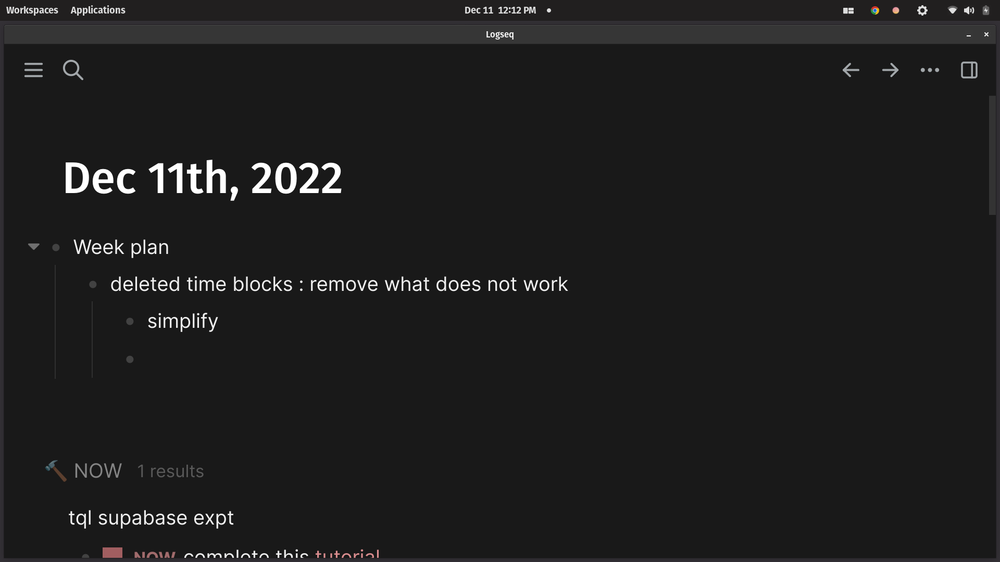

- Week plan
	- deleted time blocks : remove what does not work
	  collapsed:: true
		- simplify
		  collapsed:: true
			- 
		- were too vague. needed to be more specific about work and projects
		-
	- start of day pack
	  collapsed:: true
		- task -> paper or logseq (dont rely on internet). highlight of the day
		- workout + yt videos combo or
		- cycle plus podcast or article
- blockchain domains
  collapsed:: true
	- buildingon blockchian
		- devs building on chain
			- tips and tricks
		- companies building on chain
			- ux case study
		- tools
			- tutorials
	- thinking in blockchain
		- mindset
		- tools
		- architecture
	- goadevs dao
		- ppt
		- landing page
		- oss
		- oracle github
		- annual plan -> switch -> 100 web3 devs
	- https://unstoppabledomains.com/domains
	- connect wallet before collecting
- scrimba courses before 28th feb
	- https://scrimba.com/learn/frontendinterview daily
	- https://scrimba.com/learn/styledcomponents hackathon
	- https://scrimba.com/learn/figmatocode daily check with designcourse
	- https://scrimba.com/learn/cssanimations hackathon + notes session
	- frontend path
		- code reviews today
		- api section + react query course
		- notes app 2 hours
		- context 2 hours
		- hooks speed typing 2 hours
		- react interview qs daily
		- https://scrimba.com/learn/reactgame hack hour
		- https://scrimba.com/learn/practicalmath daily
		- https://scrimba.com/learn/reusablereact proper note taking
		-
	-