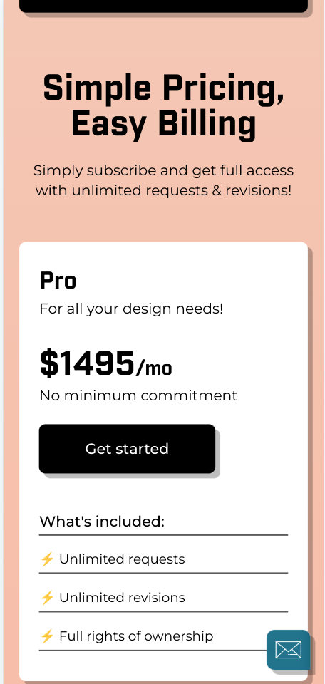
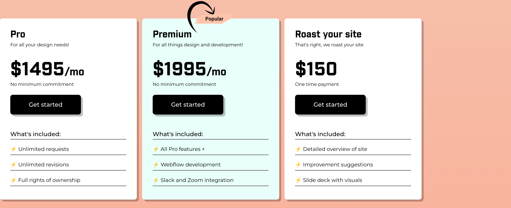

- long term goal -> find better clients
- [[embedded entrepreneur]]
- short term -> set up systems and processes
- why you need a niche
  collapsed:: true
	- what is a niche -> subset of larger market that has its own specific needs. Which are somewhat different from the larger market in some way
	- if you try to serve for everyone -> you will be avg for everyone
	- easier to market
	- you can be the best for X
	- Positive cycle
	  collapsed:: true
		- super relevant portfolio -> higher conversion rate
		- client recommend to their friends within the niche
		- uinque experience to solve niche problems
	- Some objections
	  collapsed:: true
		- big guys don't do this ? -> look up pentagram and sagmeister
		- will be boring to work within subset
			- you dont always have to offer the same solution
		- You can do only what you like and stay small or you can do what it takes to build a good business
	- passion comes with success
	- How to pick a profitable niche
	  collapsed:: true
		- dont focus on skill
		- do they have the money ?
			- how much they making or raised ?
			- how many emps  do they have ?
			- are they selling high ticket items or large volumes ?
			- are they currently paying for what you are selling ?
			- go to awwards -> check out the categories
				- https://www.mazette.co/
				- most are 4-5 fig websites
				- filter by quotes
				- my side -> go through remoteok
			- is the market big enough ?
				- how many companies exist in this niche ?
					- are they easily accessible ?
				- is the market growing ?
		- **Do you have leverage ?**
		  collapsed:: true
			- connections wuthun the niche
			- some xp ?
			- do you have a skill that is demand ?
		- How interesting is it to you ?
		  collapsed:: true
			- do you want to spend time with them ?
			-
	- Examples of niche
	  collapsed:: true
		- startups -> ran segall site
			- sumithegde.com
			- digitalfuel.marketing
		- more ex from studnts
			- vegan food providers
			- property developers -> subset of real estates
			- influencers who are selling online courses
			- wellness brands
			- industrial processing and manufacturing
			- residential arhcitects
		-
	- How to become best in your niche -> know your niche better than anyone else
	  collapsed:: true
		- learn who the imp players are -> globally and locally
		- who are the celebrities ?
			- follow
			- consume their content
		- who are the decision makers ?
			- who is going to hire you ?
			- start building relationships before you need them
		- what are their problems ?
			- find it in the news
			- find it in their blog posts
			- what are they trying to "how to "?
				- ex how to improve conversions
			- where do they hangout online and offline
				- google best blogs , podcast, event for X
				- join groups or meet ups
				- listen but also join the convo
			- jobs to be done framework
				- what lifecycle of compant looks like -> what do they need from you at each stage ?
				-
			-
	- Weekly mission
	  collapsed:: true
		- make a copy of the linked worksheet
		- make a decision and move
		- research will be lifelong process
	- some example feedback
	  collapsed:: true
		- creative industry -> too big
		- you can expand or pivot later
		- lookout for bigger trends
		-
- messaging
	- clients -> weak at judging design but understand words
		- to stand out you need to say something diff and unique vs other agencies
	- what clients really care about
		- results
			- what are you going to help them achieve ?
			- you may not be the only one who can help with that but do Own it
		- time reqd
			- can you promise a specific timeframe for delivery ?
			- can you be the fastest while still delivering the quality ?
			- can you promise saving time for them ?
		- services
			- can you provide a service that no one else is providing ?
			- do you have a unique bundle of services ?
		- process
			- USING A CLEAR PROCESS ?
			- come up with a unqiue process of your own ?
				- google -> under brand sprints
		- cX of working with you
			- you -> unique => working with ou will be unique. Can you state that in appealing terms ?
			- Do you give good service ?
			- will they have fun ?
			- how to include your personality ?
		- This weeks goal -> decide what will be your secret sauce ?
		- How to validate that clients want what you are offering
			- ask existing client -> or at least 5 ppl
		- How to craft your unique selling proposition
			- read : [[Building a story brand]] by Donald Miller
			- hero (client) -> has a problem -> meets a guide -> who gives some unique plan
			-
		-
- week 5 : your pricing strategy
  collapsed:: true
	- pricing strategy can and should change based on circumstances
	- before setting your pricing strategy you need to know
		- 1. Price range of competitors
		  2. Your cost structure
	- penetration pricing -> undercutting the competition
	  collapsed:: true
		- goal : building a portfolio
		- set a clear end mark for this strategy
	- cost based pricing
	  collapsed:: true
		- used by most agencies
		- cost + profit
		- avg profit is 15% for design agencies
		- why profit matters
			- clients do not want you to go out of business
		-
	- value based pricing
		- ppl never pay for what it costs to make
		- ppl don't care about how many hrs you work
		- how do you figure out value ?
		- Read : prciing creativity vy Blair Enns
			- The blaire enns way
				- detoutcome value by a lot of questions
				- validate numbver with clients
				- ask for a fair share of the value
			- Truth -> it is not straightforward
				- not always about money
				- not always quanitfiiable
				- won't always know or share
		- Undesrtand where tje value lies
			- business outcomes
			- your experience
			- speed
			- comfort
			- cX
			- status symbol
		- How to do it
			- Mster cost first
			- do your research
			- ask questions
			- guess -> take a risk
			- use the value as an anchor
			- develop confidence
		- value fluctuates based on market
		-
	- premium pricing
	  collapsed:: true
		- value pricing on steroids
		- value here is that it's expensive
		- design your whole business experience to be premium
		- reject 99% of clients or requests
		- do not negotiate
		- sensitive to economic downtruns
	- promo pricing
		- show full price and apply discount
		- depends on your niche and clients
		- increase and then discount
	- price packaging
		- ppl like to compare and choose
		- tier 1 bare minimum
		- tier 2 : best fir
		- tier 3 : stuff they did not even think about yet
			- TODO [[Jun 1st, 2022]] Pricing structure figma design and css grid layout
			  collapsed:: true
				- https://www.brandpunx.com/#pricing
				- 
				- 
	-
- week 6 : sales and negotiations
  collapsed:: true
	- why you've struggling with sales
		- because you are not getting the results you want
		- if you're getting a no, you are lacking a know
		- takes a lot of practice
	- much easier to sell if there is high trust
	- pre sale strategies to build trust
	  collapsed:: true
		- testimonials
		- create content
			- video about process ?
		- leverage mutual connections
	- 3 key sales principles of ran
	  collapsed:: true
		- You sell to people. Clients buy from people
		  collapsed:: true
			- do they love you ?
		- people hate sales and hate(feeling) being sold to
			- help, not sell
		- be honest and transparent
			- about the process
			- goal -> prove u r no their side. Appear as trusted advisor
	- The first call
	  collapsed:: true
		- goal -> det if good fit
		- sell the next step : meeting (not the project)
		- what to ask
			- state of company, their situation
			- what do you need help with ?
			- explain your process and then schedule in depth call
				- if can help -> will share proposal
	- The first meeting
		- problem soln story
			- to go from a to b ? -> diff modes of travel
				- factors like distance, urgency , personal preference
		- where do they want to go ?
			- leo seo keywords
		- what type of people are they ?
		- how severe is the problem ?
		- goal : discover the best fit
		- can you actually help ?
		- approach with open mindset -> in place of website can I deliver presentation ?
		- **describe deliverables and outcomes**
		- if you can, show proof
		- Ideal outcomes of first meeting
			- say the number before you show the number
			- obj -> tackle
			- price is never the issues -> do they like the soln ? is the problem big enough ?
			- have you demonstrated your value and the solution's value ?
	- negotiations
		- win-win principle
		  collapsed:: true
			- acceptable price range -> min to justify time to best -> does it overlap with client's  range ? where ?
			- ask for more than what you want to get
			- use odd numers -> look more calcualted vs even -> guessed
			- show goodwill -> let's figure out a way to make it work for both sides
			- when they ask for discount -> flinch
			- try to avoid saying no -> say I dont see how we can make this happen
			- tql -> true to roots
			- use the acquistion audit -> name their fears, make them feel understood
			- ask if we do that do we have a deal ? get a commitment
			-
		-
- Delegation
  collapsed:: true
	- when shd consider
		- someone else can do it for cheaper
			- calc effective hourly rate by time tracking each type of task
			- can someone do this for less ?
		- want to stop doing something ur not good at or dislike
	- what's your core strength ?
		- what do you want to keep doing ?
		- what to stop ?
	- warnings :
		- the fact that you can does not mean you need to
		- will it make your life better ?
		- are you slipping into agency mode unintentionally ?
	- How to delegate
		- slowly build an arsenal of experts
		- save portfolios you like online and on dribbl
		- build rel, reach out, interview before you need them
		- for development -> consider who is going to support the work afterwords
		- finances -> part time ?
		-
- Outreach
  collapsed:: true
	- [[client hit list]]
	- reaeraching likle sherlock
		- WHO (person) do you need to talk to ?
			- email ?
		- what are they working on right now ?
		- how is the business doing ? social ? traffic ?
		-
- finances
	- separate your bank account
		- change your mindset -> you are running a business
		- easier tracking of revenue or expenses
		- very easy visibility into bottom line
		- regular salary payments to yourself, no matter what happens this month
		- helps you avoid dipping into home savings
		- sets you up for growth -> delegation for handling
	- becoming profitable
		- => more money beyond your fixed salary
		- busines => risky : profit -> mitigation
		- 2 goals
		  collapsed:: true
			- buffer for rainy days
			- bonus for you
		- how your cashflow should look
		  collapsed:: true
			- 50% owner's pay
			- 30% operating expense
			- 15% ? tax
			- 5% profit
		- asseess where you are right now
		  collapsed:: true
			- what fixed salary u pulling >
				- avg of 3 weakest months
			- what ur costs ?
		- start allocating cash for profits even if 1% at first
		- pull profits money out of account as soon as you have money
		- split profit into 2
		  collapsed:: true
			- rainy fund or investment and fun money
	- assesing risk
		- list down everything bad that can happen within your business and the world
		- rank based on impact + chance
			- how to reduce the impact of the top ?
	- setting up ur accounting docs
		-
- operations and management
  collapsed:: true
	- tools
	  collapsed:: true
		- cycle => plan -> execute  -> track -> improve ->plan
		- you don't need fancy tools
	- planning tools and systems
	  collapsed:: true
		- suggested time split
			- 50% -> delivery
			- 40% marketing
			- 10% management
		- planning schedule
		  collapsed:: true
			- 1-2 days for yearly planning
			- 1-2 hours monthly or quarterly planning
			- 30-60 min weekly planning
			- 10-15 min for daily planning
		-
	- pricing, proposals and invoices
		- estimated vs actual hours
		- estimate against past xp
		- proposals
			- overview
			- why us
			- process and costs + deliverables
			- hellosign for digital signatures
		- project mgmt -> trello ?
		-
- time tracking
  collapsed:: true
	- tracking sales and marketing
	  collapsed:: true
		-
	- in a sevice business, your asset is hours
	- you need to lnow cost of projects
	- you need to learn how much things take time to better estimate
	- you need to know thta your plan is being implemented properly
	-
- Branding
  collapsed:: true
	- project as freelancer or agency ?
	  collapsed:: true
		- depends on who your client is
		- research your competition
		- for complete rebrand -> treat this as a weekend project
		- ship fast
		- only the usp + clear + credible
	- why you need your own site
	  collapsed:: true
		- easier to find you
		- controls the messaging unlike 3rd party platforms
		-
	- checklist
		- minimal
		- 15 sec rule
			- who
			- what you do
			- why should I care
		- what other flags can you add  to the site ?
			- rel logo
			- testimonials
			- talking niche lingo
			- niche imagery
		- make your messaging (frm last week consistent across all platforms)
		-
- freelance or agency ?
  collapsed:: true
	- depends on who ur clients are
	- trust vs agility
	- cat -> black or whit  till it catches mice
	- how to research competition
		- google -> target company website design
		- who's got this website or brand on their portfolio ?
		- make a weekend project -> single landing project
			- use USP
			- dont try to do too much
			- clear + credible
			-