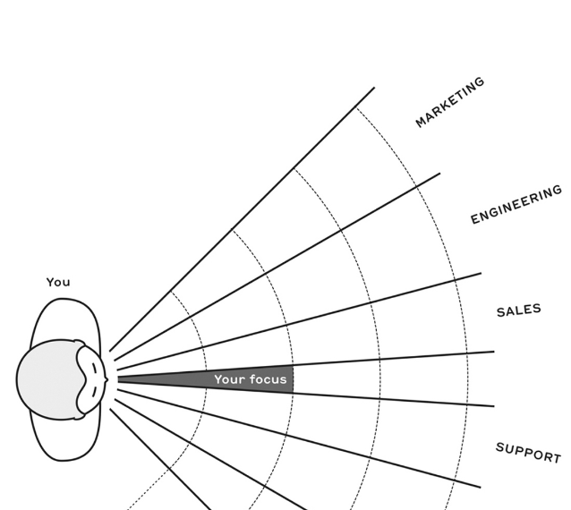

- intro
	- unorth bcz old
- Part 1 : Build Yourself
  collapsed:: true
	- iphone was tried to built twixe first in 90s
	- adulthood
		- trad schooling teaches failure wrong
		- adlthd said t of learn over
		- when career -> correct place top start is  : what do i want to learn ?
		- the only faliure in ur 20s is inaction
		- when young u think u know evthing then suddenly realise u have no idea what doing
			- the force of the gut kick will propel u into a new stage of your life
	- get a job
		- If you’re passionate about something—something that could be solving a huge problem one day—then stick with it.
		- buidl like geeks or find fit ?
			- Look around and find the community of people who are passionate about it, too. If there’s nobody else on Earth thinking about it, then you may truly be too early or going in the wrong direction. But if you can find even a handful of like-minded people, even if it’s just a tiny community of geeks building technology nobody has any idea how to turn into a real business, then keep going
		- build connections
		- u shd now where u want to go and who u want ot learn from and work with
	- heroes
		- folow ur curiosity
		- be persistently helpful
	- dont only look down
		- individual contributor (IC)—a person who doesn’t manage others
			- by default only sees trees
			- but u need to do 2 things
				- look up -> to all milsetones coming uo and look down to the why
				- look arounf  -> learen other fns at company
		- Think of a project as a straight line in time—there’s a beginning and (hopefully) an end. Everyone is walking at the same pace, day by day, on parallel lines—a line for engineering, marketing, sales, PR, customer support, manufacturing, legal, etc.
			- 
			- The details of the project right in front of you are crystal clear, but the farther you look out, the fuzzier everything becomes. And different teammates are gazing at different points on that timeline.
		- Your job isn’t just doing your job. It’s also to think like your manager or CEO. You need to understand the ultimate goal, even if it’s so far away that you’re not really sure what it’ll look like when you get there.
		-
- Part 2 Build you career
	- just managing
		- u dont hv to be manager to be successful
		- once u bcm one, u stop doing things that made u successful in the first place
		- a learned skill
	- data vs opinion
		-