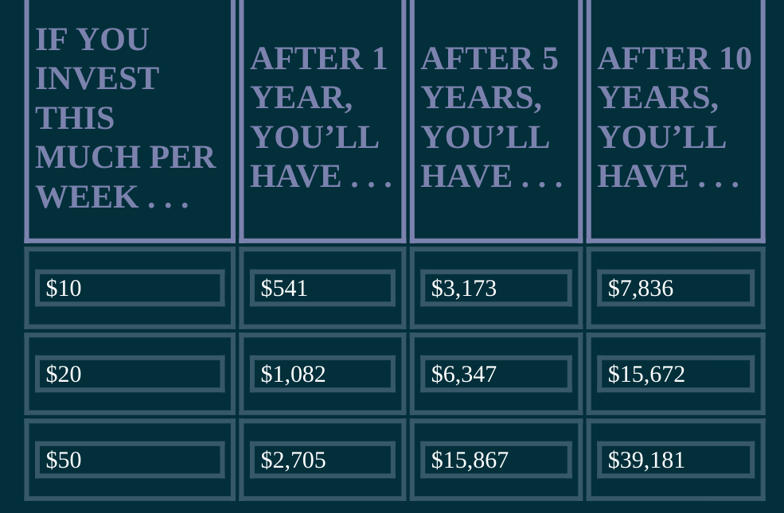
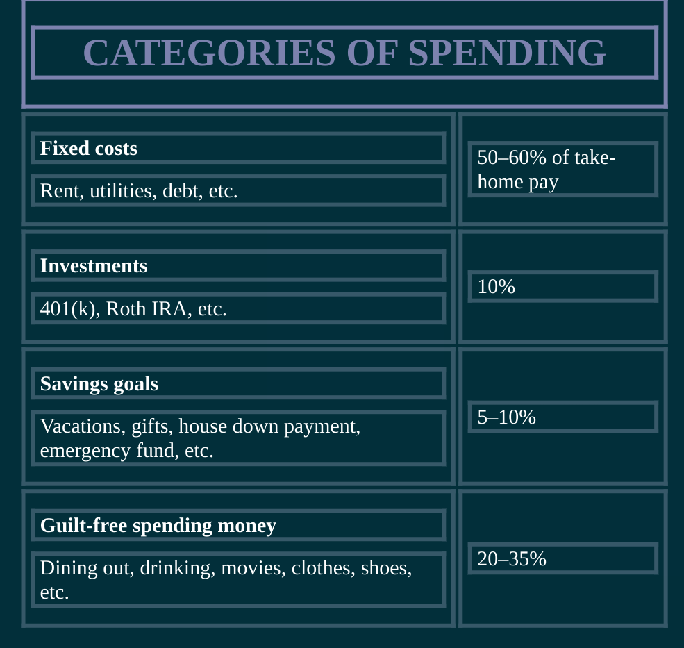

- Would you rather be sexy or rich
  collapsed:: true
	- invisible scripts are passed  down to you
	- how weight gain happens post college in normal ppl ?
		- when u discuss , ur given advice ike
			- avoid carbs]dont eat b4 bed
		- but 99% of us only need to focus on 2 things
			- eat less an work out more
	- how food and money habits r similar
		- we dont track cal intake or spending
		- eat more than we know, spend more than we realise
		- debate details of cals, diets, workouts, interest rates and hot stocks
		- value anecdotal advice over research
	- what was the end result of last such convo you had ?
		- talk substs for action for most
	- why is managing money so hard ?
		- info overload -> decison paralysis
		- rise of victim culture
		-
		-
	- **single most imp thing to be rich -> start early**
		- how to make $60k more by working less
			-
	- put the excuses aside
		- most of ur probs -> caused by you
		-
	- **the key message of thsi book**
		- how much money I need to make => **what do I want to do with my life ? how use money  to do it ?**
		- the 85% soln -> getting started is more imp than becoming an expert.
			- I’d rather act and get it 85 percent right than do nothing
			- then get on with ur life and continue doing stuff
		- spend extravagantly on the things you lvoe and cut costs mercilessly on the things u dont
		- buy and hold wins over the long term
		- dont live in the spreadhseet
		- play offense not defense
		- use money to dersign your rich life
		-
		-
	- the best mistake ramit ever made
		- inesting 2k and losing half of it
	- why do you want to be rich ?
		- money is just a small part of being rich
		- get specific
		- what are you doing in your rich life ?
		-
	- **10 rules for a rich life**
		- 1. Spend extravag on love, cut back on others
		  			2. focus on the big wins that get you disprop results
		  			3. investing shd be boring and profitable
		  			4. build a collection of [[spending frameworks]]
		  			5. ignore the advance tips -> do what is in front of you
		  
		  6.live life outside the spreadsheet
		-
- optimize your credit card
  collapsed:: true
	- usual credit scare tactics
		- scary stats, headlines,
		- scary emotions
		-
	- credit cards give lakhs worth of perks. If paid on time -> they are a free short term loan. Let you track spends easily than cash
	- playing offense : use credit to accelerate your rich life
		- our largst purchases are always made on credit
		- ppl with good scores save lakhs on thses purchases
		- 2 components of credit
			- score
				- number bet __ and __
			- report
				- gives lenders info abt ur accounts and payment history
				- tracks all credit related activities (cards and loans)
					- recent activitis are given higher weight
				-
	- rich ppl plkan b4 they need to plan
	- building credit with credit cards
		- how to choose a new card
			- don't accept mailed offers
			- get a rewards card
			- don't go card crazy
			-
		- 6 commandments of credit card usage
			- pay off regularly
			- try to get fees waived
				- do this before opting for 50k metallic card
			- negotiate a lower apr
			-
			- use card's secret perks
			-
			- beat  the banks
			- get ready to invest
			- conscious spending
			- save while sleeping
			- myth of fin expertise
			- invsesting isnt only for reach ppl
			- maintin and groww your system
			- rich life
			- get more credit. If you do not have debt
			- keep main casrds for long,active and simple
		- mistakes to avoid
			- think ahead of closing
			-
		- pay off debt aggrresively
		-
- _(z-lib.org)_1654458436420_0.pdf)
- week one action steps
  collapsed:: true
	- 1. get credit score and report
	  2. find info on onecard fee
	  3. set up auto payment
	  4.
- week 3 investments
  collapsed:: true
	- Rather than earning a little interest, like most people do in their savingsaccounts, you can earn around 8 percent per year over the long term byinvesting: Over the twentieth century, the average annual stock market returnwas 11 percent, minus 3 percent for inflation, giving us 8 percent. To put thatin perspective, let’s assume that you have $1,000 at age 35 to put somewhere.Let’s also assume that your savings account returns 3 percent on average, andthat you can get 8 percent returns, net of inflation, over the long term in yourinvestments.
	- If you just dropped that money into a savings account, what would it beworth thirty years later? While that $1,000 would have grown to $2,427 onpaper, inflation would have also “dragged” your returns down. So while itappears you did well, when you factor in inflation your money has the samepurchasing power as it did thirty years ago. Not good.
	- But there’s a twist. If you’d invested your money, it would be worth over$10,000—ten times more!—eclipsing the drag of inflation and giving youincredible results. And that’s just from a one-time investment.
	- why ur friends have not invested yet
		- It’s ironic that people are afraid of “possibly” losing money in the stockmarket, when they will certainly run out of money if they don’t invest.
		- 3 types
			- already mng and want to optimize
			- not managing but can be pursuaded with right motivation
			- c lost caushe
	- what is the india equivalen of 401k?
	- “83% ofthe wealthy say their largest investment gains have come from smaller winsover time rather than taking big risks.
		- 
	- the ladder of personal finance
	  collapsed:: true
		- join employer that matches ur 401k
		- pay off debt
		- open a roth ira
		- if any leftover go back to 1
		- health saving account
		-
	-
- week 4 concoius spending
  collapsed:: true
	- Let’s first dispense with the idea that saying no to spending on certainthings means you’re cheap. If you decide that spending $2.50 on Cokes whenyou eat out isn’t worth it—and you’d rather save that $15 each week for amovie—that’s not being cheap. That’s consciously deciding what you value.Unfortunately, most Americans were never taught how to consciously spend,which means cutting costs mercilessly on the things you don’t love, butspending extravagantly on the things you do.
	- decide what is imp
	  collapsed:: true
		- care about value not cost
		-
	- use psychologys against yourself to save
		- offload your subscriptions to employers or clients
		- buy a la carte
	- 
	- [read](http://youneedabudget.com/)
	- envelope method
		- envelope per category
		- can transfer between envelopes
		- can't add from external
		- only spend that much
		-
- week 5 save while spending
  collapsed:: true
	- use automated software
		- start with little and build th habit
		-
- myth of experts
  collapsed:: true
	- experts can't guess where the market is going
	-
- week 7 investing isnt only for the rich
	- major predictor of your portfolio’svolatility doesn’t stem from the individual stocks you pick, as most peoplethink, but instead from your mix of stocks and bonds.
	- Financial Analysts Journal that rocked the financial world. Theydemonstrated that more than 90 percent of your portfolio’s volatility is aresult of your asset allocation
	- Your investment plan is more important than your actual investments.
	- components of investment
		- stocks
			- Overall, stocks as a category provide excellent return avg 8%
			- extrm diff to pick the winning ones
			- rec to choose funds instead
		- bonds
			- predictable
			- low return
			- forr rich
		- cash
			- u will lose money
		- asset allocation : the critical factor that investors miss
		- mutual funds
			- cash cow for experts by fees
			- provide diversity
		- index funds
			- low cost and easy to maintain
		- target date funds
		  collapsed:: true
			- auto diversify based on when you want to retire
			- collection of funds
			-
		- a rich life
			- work and money -> 2 ways of getting rich -> save more (spend less) or earn more
			- noegotiating is 90% mindset and 10% tactics
				- nobody cares about you
					- only how u will make the company do well
				- dont focus on what you will cost the company
				- tie your work to their strategic goals
				- have another offer and use it
				- find out median for similar
				- have a negotiating toolbox
				- be cooperative, not adversial
				- smile
				-