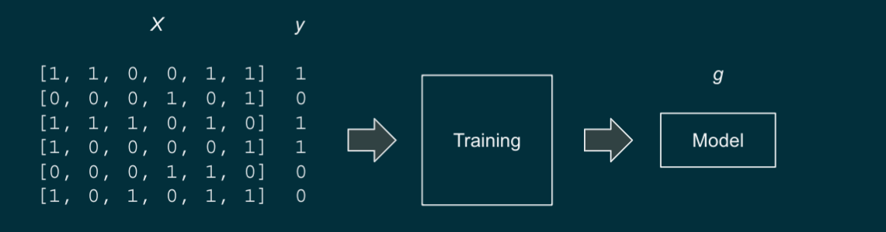
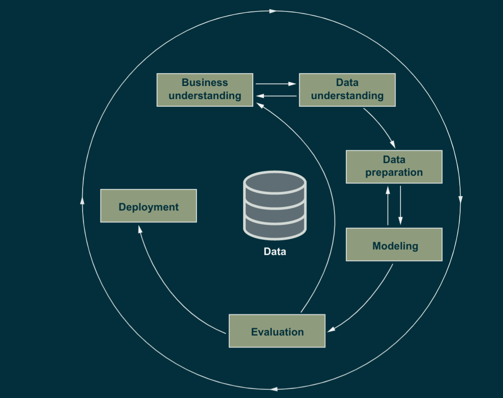

- _(Grigorev,_Alexey)_(z-lib.org)_1679379220940_0.pdf)
- ch1 intro
  collapsed:: true
	- aim
	  collapsed:: true
		- understand ml and probs solved
		- organising proj
		- training and selcting models
		- performing model validation
	- crisp-dm
	  collapsed:: true
		- step by step method for implementing ml projects
	- ml models
	  collapsed:: true
		- Machine learning is part of applied mathematics and computer science. It uses tools
		  from mathematical disciplines such as probability, statistics, and optimization theory
		  to extract patterns from data.
		- underlying principle is learing from examples
			- prep dataset with ex and use a model that learns fdrom this sert
				- we give the sys the input and desired op and system tries to figure out how to do the conversion
			- We can collect a dataset with descriptions of cars and their prices, for example. Then we provide a machine learning model with this dataset and “teach” it by showing it cars and their prices. This process is called training or sometimes fitting
		- once ths model is built we give it new input to figure out the corresp output
		- compared to tradtionoal
			- figure out logic manually by looking at data -> come up with logic set of rul;es to convert data to output -> code these rules explicitly
			-
	- ml vs rules based systems
	  collapsed:: true
		- spam detection
		  collapsed:: true
			- manually
				- look for keywords
				- look for sender
				- can work well but someone will bypass existing rulkes
				- code will thus bloat
				-
			- ml
				- delegate to ststs methods to extract these patterns
				  collapsed:: true
					- dataset of sspam
					- describing each obj (email) with set of its characters
					- model will combine the features in such a way that spam msgs are detected and no false negatives
				- new patterns => feed to the model without disturbing old data
				- with set of features we can encode any email as a feautrre vector
				  collapsed:: true
					- a sequqne of numbers that contains all the feature values for a particular email
						- we may choose to start with the following features: Length of title > 10? true/false Length of body > 10? true/false Sender “promotions@online.com”? true/false Sender “hpYOSKmL@test.com”? true/false Sender domain “test.com”? true/false Description contains “deposit”? true/false
				- [1,1,0,0,1,1] for each of the six. 1 when markes spam
				- machine will take these vectors and combines the features to predict 1 or 0 (close to)
				-
		- ex : detecting a bad loan (jai shrinath)
		- ads
	- we can use literally anthing that can be expressed as ip data + desired op to train an ml model
	- when not useful
		- ?
	- supervised ml
	  collapsed:: true
		- we supervise by showing examples. like to a child
		  collapsed:: true
			- y = g(x)
				- 
		- goal -> when model gets matrix x, fg shd give op close to y
		- process of learning g is training or fitting
		- types of supervised
		  collapsed:: true
			- regression
				- y is numeric such as car price or temp tom
				- classification -> category
					- binary
						- spam not spam
					- multiclass classification
						- car make
					- it is the most common app of ml
				- ranking
					- ordering such as order of pages in searh result
				-
		- deep learning
			- g is a neural network with many layers
		-
	- machine learning process CRISP-DM
	  collapsed:: true
		- cross industry standard process for data mining
			- sumnmary
			  collapsed:: true
				- 
			- phases
				- biz und -> id the pronelm and chechk suitable for ml
				- data und -> anal db, if more data required ?
				- data prep into tabular form
				- modeling training
				- eval
				- deploy
			-
	- modelling and model validation
	  collapsed:: true
		- emulate the scenario of going live
			- separate the dataset into 2, train on one and feed it the other part
			-
- ch2 regression
	- features -> car chars, price -> target
	- anaconda python distribution
	- EDA
		- exploaratory data aal to learn
			- distribution of target var
			- features in this set
			- distribution of values
			- qual of data
			- no of missing vals
		- main tools are jupyter matplotlib and pandas
		-