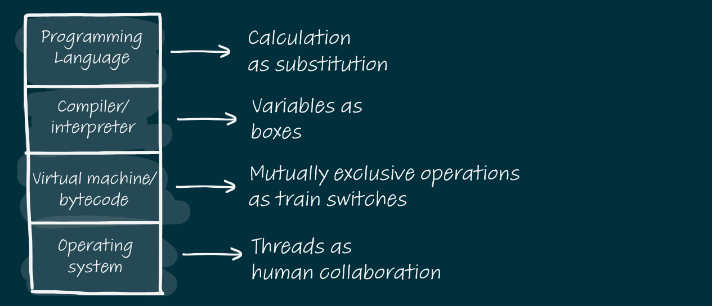

- reaching a deeper understanding of code ch 5
  collapsed:: true
	-
- r**oles of variable** framework
  collapsed:: true
	- vars play a central role in thinkign qaobut code
	- as per prof jorma Snananiemi the reason vars are hard to und is that most programmers do not have a good schema in their ltm to relate variables to.
	  collapsed:: true
		- we need some intermediat schmea b/w  chunks too desne , such as var oor int and something too  light like num_of_custs
		-
	- diff vars do diff things
	  collapsed:: true
		- 11 roles to cover almost all vars
			- 1. Fixed val -> const such as pi, data read from file or db
			  2. stepper -> variable stepping through a list of values while iterating through a loop
			  3. flag -> to ind something has happened or is the case
			  4. walker -> traverses a ds in a way that is unknown before
			  5. most recent holder -> latest val encountered in goign through a serire of values ex latest in file.readline() or el = list[i]
			  6. most wanted holder -> what val is being searched for or the best fit like min and max values
			  7. gatherer 
			  8. container -> holds els that can be added and removed. lists, stack etc 
			  9. follower
			  10. organizer -> 
			  11. temp
			- variable table cols
				- 1. var name
				  2. type
				  3. ops
				  4. role
				- LATER ts types and relation to roles philosophy . How it differes from normal js
	- hungarian notation of vars
	  collapsed:: true
		- encode type of var into its name
		-
- gaining a deeper knowledge of prgrams
  collapsed:: true
	- 2 diff levels at which programmer can understand code -> text structure knowledge and plan knowledge
	  collapsed:: true
		- surface level (what is ) vs deeper why this
	- diff stages of prog und
		- 1. focal point of ref or entry or loc of error
		  2. expand knowledge using breakpoints et al
		  3. und a concept from set of related entities 
		  4. und of coenpts across entities
		- method
			- 1. circle focal point
			  2. cicrle all related entities
			  3.
			-
		-
	-
- ch 7 bugs in thinking
  collapsed:: true
	- most common cause -> mistake in thinking
	- why learning a second langauge is easier
		- 2 ways LTM can support learning prog conepts
		  collapsed:: true
			- transfer of old concepts by lookup of relevance
			- tansfer of learning
				- non conc process
					- like closing button of pant or using keyboard
			-
			-
			-
		- how to increase chance of benfiting form existing prog knowledge ?
		  collapsed:: true
			- factors influencing
				- mastery
				- simialrity
				- context
				- critical attr
				- assoc
				- emotions
			- forms of transfer
				- gih and low road transfer
					- for automized skills
					- like keyborad shortcutd
				- near and far
					- near -> c# java
				- positive (old knowledge helps) and negative (ginders)
		- difficulties of transfer
		- LATER  use this template berween js and rusr
		  collapsed:: true
			- 
			-
		- misconception
			-
		-
- ch6 getiing better at solving programmming problems
	- use the right mental models
	  collapsed:: true
		- LATER vars as tags rather than boxes  draw this
	- learning new models
	  collapsed:: true
		- how to use models efficiently to think about code
			- concrete models work better
			- **creating mental models of src code**
			  collapsed:: true
				- begin by creating local models
					- such as state tables and dependency graphs
				- 2 list all relevant objects in the codebase and the relationships between objects
				- ans these qs about the system
				  collapsed:: true
					- what are the most imp elements
					- what are the  rels bw these els
					- main goals of the program ?
					- how does the goal relate to the code elements and their relationships ?
					- what is a typical use case ? it it covered in the model ?
				-
			- mental models in the ltm
				- use flashcards : code :: concept
				- some genreaslly useful models
					- data structures
					- design patterns such as observer
					- architectual such as mvc
					- diagrams such as ER or sequence
				- create flashacards for metnal model;s and explainations too
			- LATER weblfow project of programming flash cards
	- notional models
		- consistent and correct (mental has room to be opp)
			- notional machine
				- examples
					- factory worker as a langauge execution model
				- levels
				  collapsed:: true
					- 
		- notional machines and lang
		- schemata
			- ways in which ltm stores info
				- ex idea of a box and how it is operated
				- causes no extra cognitive load
				-