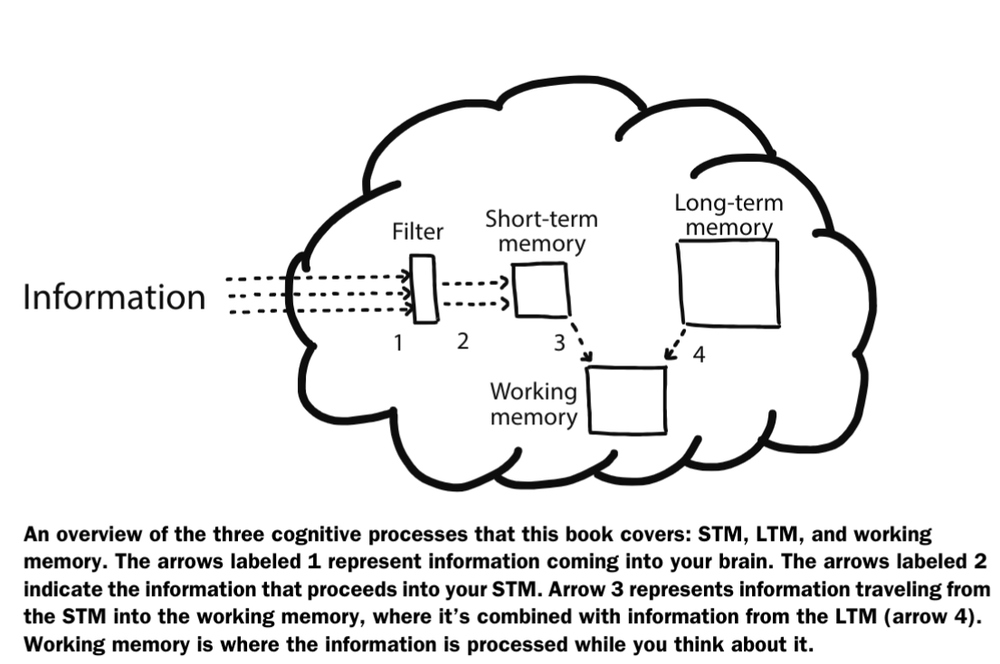
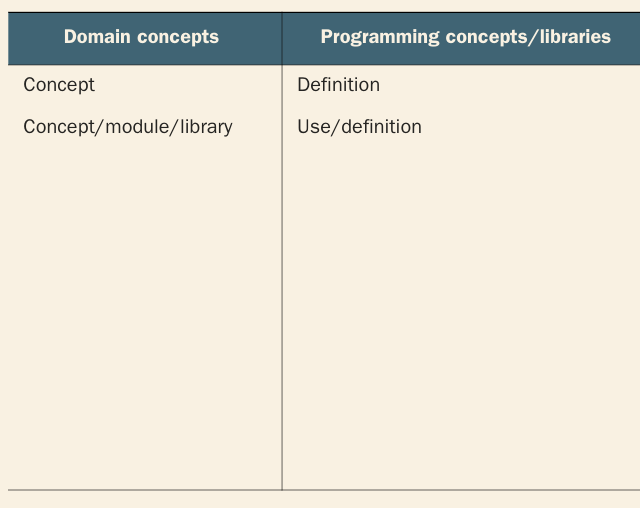

- _1649481271237_0.pdf)
- what every programmer needs to know about cognition
- why read
	- I’ve  spent  a  lot  of  my  life  thinking  about  programming,  and  if  you’re  reading  this book  you  probably  have  too.  I  haven’t  spent  nearly  as  much  time  thinking  about thinking,  though.
	- This book is the result of the last few years of me reading books, talking to people, and attending talks and conferences about learning and thinking
	- There are so many ways in which you can shoot yourself in the foot while programming. As you will see in this book, many of the errors you make are rooted in cognitive issues.
	- aim of the book -> help you und how your brain processes code. WHat it does whjebn persented new info as pro progreammers are faced with new info often.
	-
- key concepts : LTM, STM and working memory
	- 
	-
- 13 chapters 4 parts.
	- read in order
	- 1 -> 3 cog processes that play a role when prog. Confusion related to each
	- 2 -> how to quickly read code and get a sense of its working
	- 3 -> how to learn syntax and  concepts faster
	- 4 -> read complex code
	- 5 -> reach deeper understanding of unfamiliar code
	- 6 -> solving prog problems
	- 7 -> avoid bugs in thinking and code
	- 8 -> var names
	- 9 -> code smells
	- 10 -> advanced topics to
	- 11 -> variert of tasks in prog
	- 12 -> ways to improve large code base
	- 13 -> onboarding of new devs
- [[Part 1 Reading code better]]
- [[Part 2 Thinking about code]]
- [[Part 3 How to learn syntax quickly]]
- [[Getting Better at solving complex problems]]
	- elements of problem solving
	  collapsed:: true
		- 1. The goal state
		  2. start state
		  3. rules of approach
	- all states to be considered form the state space
	- role of LTM in problem solving
	  collapsed:: true
		- problem solving by itself is not a generic skill or a cog process
		- it is easier to solve fami8liar probs
		- Steps
			- 1. und
			  2. define plan
			  3. carry
		- in steps 1 and 2 LTM is looked up
		- how to teach yout LTM to solve problems
			- procedural mem vs declerative mem
				- u need to strengthen the implicit mem
				  collapsed:: true
					- by reps only
					- why automatization will make you progrm quicker ?
					  collapsed:: true
						-
- part 4 collab
  collapsed:: true
	- how to onboard new devs
	  collapsed:: true
		- issues in onboarding process
		  collapsed:: true
			- throwing lot of new info on newcomer -> high cog load
		- diff b/w experts and novices
		  collapsed:: true
			- expert -> brain stores large amnt of mental models
				- strategies such as writing a test for the issue first, restarting env etc (episodic mem)
				- may not know all but have idea of how to approach a problem
			- experts can chunk more effectively -> one piece to tackle than many
			- beginners behaviour in depth
			  collapsed:: true
				- neopiagetian model
					- sensorimotor stage ->infant => incoherent undrstanding of program execution. Cannot trace a program
					  collapsed:: true
						- dont expln general concepts separate from code. give an understanding of execution model.
					- preoperational -> toddler => reliably predict outcome of mutiple loc. often makes guesses about what a piece of code does
					  collapsed:: true
						- most frustrating
						- improve code vocab by flash cards
					- concrete operational -> pre teen => reasons about code by reading the code itslef
						- start using diagrams
						- try diff approaches rather than getting stuck at one
					- formal operational => reason logically, consistently and systematically.
						-
					-
			- learning new info can make you temporarily forget things
			- seeing concepts concretely vs abstractly
				- a beg's und follows a semantic curve
				  collapsed:: true
					- see concept in general
					- unpack -> how it works
					- details
					- come back to the abstract level -> repacking
					- high flatline -> know ll concepts but havenbt coded
					- low -> opp
					-
					-
					-
				-
			-
			-
		- activities for better onboarding process
		  collapsed:: true
			- limit tasks to one prog activity
				- exploration -> browsing codebase to get general sense
				- searching -> by fnlty
				- transcription -> working on a specific method
				- comprehension -> summarazing a method in natural lang
				- incementation -> adding a feature
				-
		- support the memory of the onboardee
			- support the ltm -> explain relevant info
			  collapsed:: true
				- that plays a key role
				- document likely encountered issues and concepts
					- separate domain learning from exploring code
						- flash cards
						- 
						-
			- support the stm
				- prepare small focused tasks
					- write a summary of concepts -> logbook
					- keep relevant references ready
					- support the working memory -> diagrams
				- read code together
				  collapsed:: true
					- activities from lan reading
						- activating -> activley thinking of related things to activate prior knowledge
							- do it before coding or reading
						- determingin importance
						- inferring -> filling in gaps
						- monitoring -> keepig track of und
						- viz
						- questioning
						- summarizing
						-
	- the act of writing code
		- activities involved in coding
			- searching
				- FOR SPC INFO PIECE
					- bug, var , fn defn
					- debugger or print sttmt used
					- best supported by making notes to offload working mem
						- map out your strategy on it
			- comprehension
				- reading and xcuting to gain und
				- takes up half of of your time
				- running test code
				- draw model of code and update
			- transcription
				- just codeing
				- uses ltm so will depend on qualtiy of knowledge
			- incemementation
				- adding feature
				- mix of all 3 prev activitieds
				- split into smaller tasks
					- to target the right mem system
			- exploration
				- skecthing with code
				- gain clarity with progress
				- master your toools
				- make notes rough enough to not slow you down
				-
		- how to support your brain on coding
		  collapsed:: true
			- prog tasks require warm up
				- cog load highest in middle of task
				- thus there is warm up and cooling down phase
				- warm up to build up the mental model
				-
		- interruptions and how to recover
		  collapsed:: true
			- common. on avg 15-20 min
			- 20% of dev's time
			- Acc to Chris Parnin -> just one 2 hr unint session per day
			- 62% of mS devs report recovering from interruptions as serious problems
			- how to prepare for interrupts
				- store your mental model
				  collapsed:: true
					- code by itself seldom explains thought process
					- explain the why in cooments
					  collapsed:: true
						- John Ouster-hout nicely describes this in his book The Philosophy of Software Design (Yaknyam Press,2018): “The overall idea behind comments is to capture information that was in the mind of the designer but couldn’t be represented in the code.”
					- brain dump your current state before tending to the distraction
				- help your prospective memory
				  collapsed:: true
					- the mem of remembering to do something in the future
				- label sub goals
					-
			-
		- when to interrupt a programmer
			- after completing a sub goal
			-