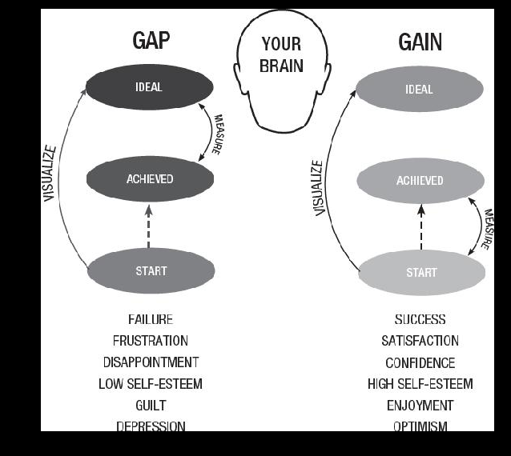

- //ass
- Intro : why most pp are not happy
	- pursuit of happiness
		- Thomas Jefferson penned the *Declaration of Independence* in 1776, and Americans have been unhappy ever since.
		- One specific phrase has come to define American culture and psychology: “Life, Liberty and ***the pursuit*** of Happiness.”
		- idea of happiness. He believed we should aspire to it, but that its actual attainment was likely impossible.
		- In 1763, the 20-year-old Jefferson wrote a letter to a college classmate, John Page. He shared a recent experience of being rejected by a woman.
		- Perfect happiness, I believe, was never intended by the Deity to be the lot of one of his creatures in this world; but that he has very much put in our power the nearness of our approaches to it, is what I have steadfastly believed.”[1](javascript:void(0))]
		- The *pursuit* of an unreachable happiness was part of Jefferson’s cred
		- This philosophy was the basis of his thinking not only as a romantically inclined youth, but also as a middle-aged man who was envisioning the principles of a new nati
		- You don’t pursue something you already have.
		- Even if we’ve already achieved something great, this pursuing keeps happiness always up ahead and around the corner.
		- Happiness is after the *next* achievement.
		- When you’re chasing happiness externally, it’s because you’re disconnected internally. And when you’re disconnected internally, then you’re trying to fill a GAP.
		-
- gap -> measure of ideral
	- You could be in the GAP about getting the smaller half of a cookie (more on this later). Or you could be in the GAP about your entire past—wishing your life had been something different or better.
	-
- gain -> related to starting point
- 
- get off the gap treadmill
- be in the gain for others
- part 1 get out of the gap
	- embrace the freedom of wants, and get rid of attachments of needs
	- dan jansen story
	  collapsed:: true
		- winning olympic gold in last race
	- my 6 months in the gain
		- example of my unhealthy needs
	- exercise 1
	  collapsed:: true
		- what do I feel I need to be happy
			- money
			- gf
			- impact
			- completed projects
			- leanring A LOT AND becoming knowledgable
		- who or what do I measure my progress against ?
			- right now against myself from yesterday which is too low and against peers who are too ahead. What if i compared against an ai that was in the godlilocks zone ?
		- when is a time in life whewre I made something or someone into a need and thus created an unhealthy gap in life ?
			- basically every hackathon and job chase, all previous love affairs
			- many family affairs
			- many prefectiionist tasks
			- social events and the need to be noticed
			- writing when i turned it into some sort of achievement systsem
	- Obsessive vs harmonious passion
	  collapsed:: true
		- ex 2 passion
			- in what areas obsessive passion ?
				- agency
				- coding
				- hackathon prizes
				- love life especially romance
				- perfect daily routine
			- what is my long game ? -> abt doing what I love
				- not really that well defined
			- do i have a long enough time table to slow
				- no, right now only aiming till ethindia fellowship
			- down and enjoy being here ? or trying quickly to  get there ?
				- trying too quickly  in almost everything. a quick way to enjoy is to write about it may be switch to atomic essays book and create multiple per day
			- what are the current gains >
				- afternoon wxercisw
			- how would my priorities change if I was playing the long game
				- would rest and recover better and teach more often
			- **harmonious passions exercise**
				- Are there any areas in your life where you have obsessive passion? If so, what unresolved internal need are you trying to fill?
					- almost every area actually. biggest unresolved need is the need to be loved and appreciated for who I am, indeopendet of what I provide. buit for that first i will need to start loving myself that way. and that will come after getting some quixck wins. not circular logic but spiral for sure, decreasing
					  				  What about your life and work do you love?
					  space to think properly
					  				  What is your long game? When you’re playing the long game, you’re doing what you love. You’re not doing something just to get somewhere else.
					  content creation
					  				  Do you have a long enough time table to truly slow down and enjoy being here, or are you trying to quickly get “there”?
					  quick. need to elongate
					  				  Look at your life right now—what are all the GAINS you can think of?
					  beginners mind with experineced failures
					  				  How would your priorities change if you were playing the long game?
	- freedom from vs freedom to
		-
- ch2 be self determined
	- define ur own success criteria
		- what are your reference points ?
			- why di you choose it >
			- how do you measure and define success for yourself ?
		- appreciate progress first
		- flip => I will be successful when -> I know i'm bveing successful when
		  collapsed:: true
			- list of 10 activities in [[my circle of influence]]
	- edu sys hinders creativity and autonomy with its measurement of success
	  collapsed:: true
		- against a ref point
		- ex 3 defining success
			- what are ref points I measure myself against ?
			- whyu did I choose this particular ref point ?
			- how do I define and measure success for myself ?
		- become self determined
		-
	- eliminate justification
	- create a list of success criteria -> will it make the boat go faster ?
		- ocean , boat digital agency
			- compass ?
- ch 3 compound effect of gap or gain
	- mental subtraction
		- one thing to eliminate -> its effect on you  and others
	- give urself 5 mins in the gap, the n move forward
		- set up[[implementation intention]] for dealing with setbacks and distractions
		- habit stack -> after I {gap}, I will ${gain}
	- LATER  article on list of app ideas that can be solved by carrying a journal -> ask which want to be implemented -> advance payment
	- https://www.greensoul.online/collections/renewed-products/products/renewed-vienna-mid-back-executive-chair?_pos=3&_fid=45b97b149&_ss=c
- part 2 get into the gain
	- ch4 always measure backwards
		- ur brain hasd evolved to forget gains
		- concoius competence  learning model -> out ino agencey vallues
			- unconc icnopetence
			- concious incomptetenbce -> udk how to do something but can see ur ignorance and lack of skills
			- concious comeptence -> need concerntration
			- unonc compet
		- move towards what is growing
		- ex 4
			- wins from past 90 days
			- desired wins for next 90 days
			- where will I be in 12 months ?
			- in 3 yrs ?
		- compare hwer u r vs where u were
		- specific gains -> detail out improvements. More effective
	- ch5 measure 3 daily wins
		- last hour of the day -> gain hour
			- use for 6 fig freelancer
		- Josh Watzking , chess prodigiy and author of art of learning (download)
			- proactive day architecture
				- designed by u rather thna bounicng around distractions
				- hour b4 bed -> time to think abt most imp problem or question tro solve
				- morning -> meditate nad journal abt same problem or oppo
				- creativity is primed just post rem sleep
				- atomic essays b4 bed
				- read and integrate  5 am club here
	- ch6 transform every xp into a gain
		- flexiibility -> have redundancies
		- create ur own meanings for bad xp
			- value creates meaning
		-