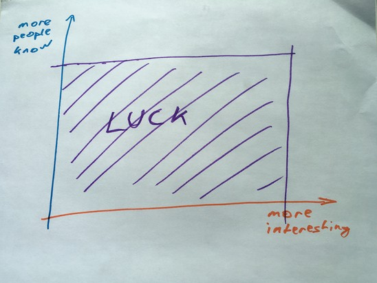

- _(z-lib.org)_1651215668877_0.pdf)
- Why senior devs get nothing done
  collapsed:: true
	- start of job -> sheer amnt of thins to learn was overwhelming, cal is free
	- a good manager will put you on one long project. It is the best way to learn
	- senior devs -> schedule punctured with ultiple responsibilties
		- to fix
			- utilise timeboxing
			- optimize (re read)
				- mental tools are like duster. could not find, so had to look for else. better to file in easy to retrieve way
				- when q -> solved. document it and share
				- reuse libs and templates
				-
- so how do you become a senior engineer ?
  collapsed:: true
	- own the process
		- be the PM u want to see in the world
		- ask many questions until you are sure you understand both the spec and its spirit
	- certainty makes thew difference
		- u gon be done tom ? -> no, here's why
		-
- Your career needs a vision
  collapsed:: true
	- The Art of Science and Engineering, Richard Hamming says the key to a great career is vision.
		- even a small push or pull of 10% can make a huge diff
	- working in your careeer vs on it
		- If you want to improve your career a lot, you have to work on your career. You
		  have to do work that force multiplies yourself, not just those around you.
		- You can become a better engineer specialist through pet projects. Explore some
		  new tech, develop some new skills. Watch talks, read blogs, go to conferences.
		  Learn more skills.
		- Next time somebody needs a thing, you can say, “I can do that!”.
		- 
		- An easier way at the beginning, and harder when your projects take off, is to
		  work on open source. It’s a lot like giving talks, but easier to fit in your schedule.
		  Until you’re famous. Then it’s harder.
		- You can be a connector. Go out and meet people. Introduce people to each other.
		  Make people comfortable in social situations. Connect person who needs X with
		  a person who knows X
			- An engineer who is good at social is a rare breed. Your career will skyrocket.
			  This is how you become a VP of Engineering. You think they code? No, they
			  deal with people
			- **The connector approach works best if you ever want to start your own team. Oh,you need 5 engineers with skills in X, Y, and Z? Yeah, I know them. I’m buddies
			  with 10 of them. I’ll have a team put together in 2 weeks**
			-
	- what a hockey legend can teach you about career dev
		- engineering growth club -> weekly get together. Why not explore places together ?
		- wayne gretzky
			- skate to where the puck is going to be. Not to where it has been
				- so how do you choose from a sea of options
					- everything develops around its edges
					- look around and id the tallest peak
						- go for it till you hit the plateau
							- from there u have a better view, spot the next peak
								- article on visualising this asw m y map draft
		-
	-
- how to grow your career
  collapsed:: true
	- agency -> all projects are similar
	- 3 ways
		- mgmt
		- entrepreneur / consultant
		- bigger company with bigger problems
		- new stack
			- in adjacent fields where you can augment your skills
	-
	-
- Grit for software developers
  collapsed:: true
	- strongest predictor of long term success
	- key diff in how u respond to setbacks
	  collapsed:: true
		- growth vs fixed mindset
		-
	- grit is learnable
	-
- Do more. Work less
  collapsed:: true
	- The Jar of life
	  collapsed:: true
		- rocks -> imp pebbles -> commits. Sand -> shallow
	- buy time if you can
	  collapsed:: true
		- u earn more than u need immediately -> u buy others time -> u have more free time
		-
	- focus
		- at what u are uniquely good at. Outsource everything else
		- solo vs team dev
			- furst 90% -> fast and solo
			- 2nd 90% -> slog => teams
			- surgical teams
				- sell ur expertise as the senior. chef management
				- read [[extreme ownership]]
				  collapsed:: true
					- at its core, EO is about overcoming obstacles
					- ur ownership shines on your worst day
					- what makes senior stand out -> how and when to ask hor help
						- ur job is to ensure that the office is clean. Not cleaning it
						-
				- ur job is to take up the crap work that no one else is willing to
				- nurses and assistants are there. But if patient dies it is your fault
				- wxplain everuthing required to everyoner imp and then focus on your critical work
				-
				-
			-
		-
- Should you work at a startup ?
  collapsed:: true
	- the modern startup hustler is an employee with the mindset of a freelncer
		- you get a job, you do the thing. You move on
		-
- what if engineers were paid like athletes ?
  collapsed:: true
	- hiring incentives in tech are shifting
	  collapsed:: true
		- old -> headcount
		- new -> only the imp are retained who bring home the bacon
		  collapsed:: true
			- seniors -> they get shit done
			-
		- how to get rich
			- 1. Get coding job
			  2. Quit and new job every 2 years with 30% raise
			  3. Put 20% in index funds
			  4. wait 16 years
		- https://twitter.com/ArvindVermani/status/1288869833539551235
		-
	- get aggressively better at work
		- athletes are paid for value
		  collapsed:: true
			- Sponsorship money.  Notoriety. Daniel Ricciardo is the 4th highest paid F1 driver despite bad race results.
				- LATER atomic essay on daniel and how you can take adv as a dev
					- he looks good on cam. and has a fanbase. Value
		- Your value -> expertise
- [[How your environment holds you back as a developer]]
- What Author learnt by working at google
  collapsed:: true
	- shift left. The earlier you find a mistake, the eaiser it is to fix
	  collapsed:: true
		-
		-
		- [[static analysis]]
		- [[unit tests]]
		- [[Integration tests]]
		- [[code review]]
		- qa -> few hours or days to check
		- users -> find edge cases u never thought was possible
		-
		-
		-
		-
		-
	- automate common tasks
	-
- [[Engineering Daybook]]
- http://nightowlsbook.com/
- [[Ethindia Application Project]]
- salary and equities
	- The mindset shift I urge you to consider is this: It doesn’t matter how hard or
	  how much you work, it only matters how much value they get.
	- Tell your friends how much you make. Figure out together how you all can make
	  more.
	- Just a $2000 salary increase can compound into $178,000 of lifetime savings
	  and that’s kinda crazy
	- should you work at startup ?
		- If you can get paid really well, have stable income, work on problems you enjoy
		  solving, and work in nice offices with free lunch ... why would you resist? Go be
		  a normie.
		- br an employee with the mindset of a freelancer
			- **