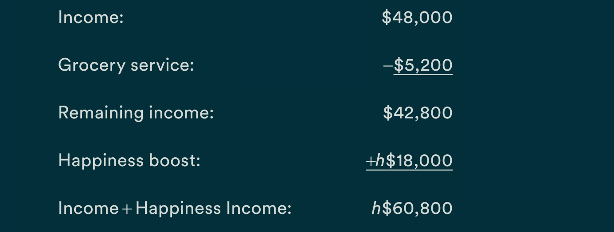

- Step one : know your default settings
	- I’ve met extreme Taylors, too, including a digital media strategist who would rather buy a significantly more expensive toaster quickly than spend hours of his life researching the best deal.
	- Remember,  these  default  mindsets  aren’t  good  or  bad;  they’re  set  through our life experiences and social environments. People who grew up  poor,  live  in  areas  with  high  levels  of  income  inequality,  and  feel  uncertain about their financial future learn to focus more on work and making  money.3  And  this  is  likely  the  right  decision.  People  who  are  struggling to make ends meet are often happier when their default is set on the money side of the spectrum
	- Yet people who value money, and are in a position to be happier that way,  still  benefit  from  making  time-related  choices.  The  years  of  data  I’ve collected suggest that no matter where you start, you should move at least a little bit toward the Taylor (time) side of the spectrum. The people who accumulate time affluence and happiness have done just that.
- Step two : document your time
	- use decisions. One of the best ways to do this is to spend an upcoming Tuesday keeping a detailed log of how you spend your time. (You’ll find one in the toolkit at the end of this chapter.)
	- Why  Tuesday?  Tuesdays  tend  to  be  fairly  routine  workdays  when  people  usually  experience  more  negative  feelings  and  greater  stress  than other days, so it will capture more of the activities that are making you time poor.
	- Note exactly how you feel about each activity beyond positive or neg-ative.
		- For example, was the activity unproductive or productive?
		- Pleasurable  or  purposeful?
		- This  additional  step  is  important  when  you’re  accounting for your time and thinking about the meaning that certain activities add to your life.
	- We  should  pay  extra  attention  to  time  spent in unproductive activities that make us stressed, and we should ask ourselves whether we can focus more on accumulating productive, pleasurable, or meaningful experiences instead
	- **For activities that made you stressed and unhappy, ask your-self whether it’s possible to spend less time on them. For any task you can’t  (or  shouldn’t)  get  out  of—like  work  or  exercise—ask  yourself  whether it is possible to make the activity more pleasant or less tense.**
- three Find time
  collapsed:: true
	- marie kondo method
		- obesrve -> do i love this activity ? -> if not discard -> app around this ?
	- labor economics , maximizinf personal u index
		- cal the %ge spent in activites that being you happiness vs those that give you misery -> maximize the positive -> minmize the negative
	- trasform bad time
		- Finding  time  starts  with  taking  small  moments  of  “bad”  time—while  commuting   or   waiting   in   line—and   injecting   it   with   happiness-producing activities such as listening to audiobooks or music.
		- Without much effort you can probably think of several activities that you  can  transform.  Meetings  are  a  source  of  time  poverty  for  many  people,  so  review  your  calendar  and  uninvite  yourself  from  as  many  meetings as possible, and use that time to walk outside instead. Close email until the end of the day so you aren’t constantly bombarded by interruptions. Turn off your cell phone on Saturday, and enjoy making and eating grilled cheese sandwiches with your niece.
		- you should calculate the time shift to see how. Suppose you find time to practice guitar instead of attending an optional forty-five-minute  meeting  that  takes  place  on  Fridays,  when  you  typically  work from home. The simple calculation of forty-five minutes over fifty-two  weeks  means  you’ve  transformed  thirty-nine  hours—a  day  and  a  half—of  your  year.  And  the  added  benefit  of  using  these  thirty-nine  hours for something that brings you joy can intensify the time affluence effect.
	- augment good time
		- Is there a positive activity (either productive or unproductive) that you want to do more of? For me, reading and listening to music are two of my hap-piest experiences, so I am purposeful about filling my downtime with those  activities.
		- Even  a  few  minutes  of  your  happiest  or  most  purposeful  activities  can make a difference. One night a week, you might order takeout and spend the time reading instead.
	- Hack work time
	- practice the right kind of leisure time
		- It’s important we do not spend all of our free time flipping through internet memes and generally lying about. Free time devoted to active leisure—activities  like  volunteering,  socializing,  and  exercising—promotes  happiness  far  more  than  spending  time  engaged  in  pas-sive leisure activities like watching TV, napping, or online shopping.
		- When my colleagues and I studied this, we were not surprised to see that  millionaires  were  (a  tiny  bit)  happier
			- However, money  wasn’t  what  made  these  millionaires  happier.  Controlling  for  wealth, the millionaires spent thirty more minutes per day engaged in active  leisure,  and  forty  fewer  minutes  engaged  in  passive  leisure  like  “watching  TV”  or  “doing  nothing.”  That’s  a  seventy-minute  swing  in  time-affluent  behavior.20 Over a year, this practice creates a large gap in time use, with the wealthy devoting hundreds more hours to activities that make them feel more time affluent and happier.
	- find more time for meals
		- automate
	- find time to meet new people and help others
		- The  benefits  of  having  high-quality  social  connections  are  similar  to  those of getting regular exercise and not smoking.
		- This may seem backward, because volunteering actually takes time. But  this  prosocial  activity  boosts  mood  and  increases  time  affluence,  because we feel more in control of our time when we feel we can choose to give some of it away.25 If you commit to finding two minutes per day to  say  hi  to  a  stranger  or  do  something  for  someone  else,  you’ll  have  added twelve hours of prosocial time to your year.
	- find time to experience awe
		- Taking  scenic  hikes  or  spending  a  few  moments  looking  up  into  the  sky can rejuvenate you. Awe-inspiring experiences reduce time stress.26When you’re thinking about what activities to add to your schedule, try blocking in time for a walk in the park
- step four fund time
	- To decide whether outsourcing is worth it to you, ask yourself whether your time is worth more than what it would cost to outsource our most negative and unproductive experiences.
	- Also, don’t underestimate how much it’s worth spending to get your time back. It seems like a lot, because you’ve been hardwired to always think  about  spending  as  little  money  as  possible.  Moreover,  it’s  hard  to  know  how  much  money  these  hard-to-quantify  ideas,  such  as  expe-riencing  less  stress  and  gaining  time  doing  something  you  love,  are  worth. Soon you’ll calculate the value of such factors. In the meantime, you might be surprised by how much better you’ll feel spending extra money for what might seem like an extravagance.
	- subtract your chores but not too many
		- und what u want to outsource
		  collapsed:: true
			- Research  I  conducted  with  the  smart  phone  application  Joy showed that many consumers were more satisfied with subscription dinner  services  than  food  delivery.33  This  is  probably  because  many  of us like cooking, but we don’t like having to think about what we’re going to make or how to purchase ingredients in the right amount
			- think  critically  about  your  disliked  tasks.  What  is  it  you  really  don’t like? Do you not like commuting, or is it that you usually don’t do anything else except stare at someone else’s bumper during that time instead of paying to stream music or a podcast? Look to fund the most disliked part of the task you don’t like doing.
			- For example, funding time by using a grocery delivery service allows you to spend more minutes engaged in the part of making a meal that you like—cooking. Again, a quick calculation shows you’re still saving time: getting rid of deciding what to eat (ten minutes) and shopping for the food (twenty minutes) only once a week frees up twenty-six hours in a year. You might save more time ordering takeout, but you’d also remove positive cooking time.
			-
	- don;t assume you can't afford to fund time
	- if still feeling guilty, ask for time saving as a gift
	- do less comparison shopping
		- LATER  ARTICLE on buying  ultrawide monitor -> what it would have been to buy normal one
	- reframe time
	  collapsed:: true
		- We can count up minutes and assign costs to our time, and we should. But we can also change how we feel about our time
		- For  example,  we  know  from  research  that  deliberately  savoring  an  experience can change our perception of it
		- In one study, the simple instruction  to  treat  the  upcoming  weekend  “like  a  holiday”  changed  how people approached their weekends by increasing how much they savored their free time, improving their mood.
			- Conversely, ruminat-ing on the past (e.g., thinking about our workweek) or anticipating the future (e.g., thinking about our upcoming week) makes us feel pressed for time. By focusing our attention in the present, we become sensitive to existing pleasures, increasing time affluence in the process.
		- Similarly, people who deliberately set goals during their car commute, such  as  planning  for  their  upcoming  day,  enjoyed  their  commute  more  and were less likely to want to quit their jobs, because they felt more pre-pared for the day ahead.47These studies suggest that you can find better time by reframing what you think is bad time as some form of good time.
		-
	- meta reframing of time
		- preciousness  of  time  changes  how  we  feel  about  it  and  encourages  us  to  extract more happiness from even the most mundane activities
		- Research I’m doing on near-death experiences gives us some of the best  findings  on  the  time  value  of  valuing  time.
			- I’ve  discovered  that  people  who’ve  nearly  died  feel  as  if  time  moves  more  slowly.  They  are  more grateful for daily experiences, and they prioritize socially focused goals over professionally productive ones. As one person who died (four times!) on the operating table explained to me, “Every single one of my relationships has changed. I have a new respect for the people I love and take nothing for granted. My mother and I are much closer. My sisters and I are much closer. It has made me see how short life really is!
	- I’m often asked, “How much time should I spend finding time versus funding  time?”  There’s  no  one  answer.  Start  by  looking  back  at  the  Taylor or Morgan spectrum. If you are a moderate to deeply devoted Morgan  and  are  money-focused  (like  me),  you’ll  likely  want  to  spend  more effort finding time versus funding time. Trying too hard to fund time  will  likely  cause  you  stress.
		- In contrast, if you skew toward Taylor, focus on funding  time.  You  won’t  worry  as  much  about  spending  cash  to  buy  back  time.  But  you  should  also  spend  some  effort  on  finding  time  as  well
- Money  is  easy  to  measure,  whereas  smarter  time  is harder to gauge. We need a metric to show us how much our time is worth.
- Time Accounting framework
	- hat  this  and other experiments confirm is what you might expect: we are more sensitive to small losses of money than small losses of time. We feel we’ve lost more if we choose cheaper tickets than we do if we choose tickets based  on  working  fewer  hours.
	- happiness dollars
		- LATER uc ui example for $happiness coin
			- framer js ?
		- valuing time h$ 2,200
		  collapsed:: true
			- Based on making $50,000in household income per year, shifting your mindset  from  valuing  money  to  valuing  time  produces  the  happiness  equivalent of making another $2,200 per year; that’s $2,200 happiness dollars. (I use h$ as a marker for happiness dollars.)
		- savoring  h$3,600
		  collapsed:: true
			- Savoring is a form of mindfulness, because it requires you to discon-nect from productivity and efficiency and focus on the present. Savor-ing also requires you to let go of creating the “perfect experience” in favor  of  creating  a  good  one.  In  research  we  call  the  former  types  of  people maximizers, and the latter satisfiers.
			- Maximizers stress over which restaurant to go to, what to order, and whether the experience is  living  up  to  expectations.  In  contrast,  satisfiers  pick  a  place  and  a  meal without worrying whether they’re exactly the right choices. Then they experience the meal without thinking about whether it’s what they hoped.
			- In my calculations, shifting from maximizer to satisfier behav-iors is worth h$3,600.
		- outsourcing: h$18,000
		  collapsed:: true
			- 
			-
		- If grocery  shopping  took  2  hours  per  week,  you  now  have  an  extra  104  hours—more than four days—to fill with happiness-producing activities like volunteering, exercising, socializing, or engaging in other hobbies.
		- Socializing: h$5,800 or more
		- Active Leisure: h$1,800
		- costers
		  collapsed:: true
			- Chasing deals: −h$3,300
			- Vacation: h$4,400
		- calc and account regualry using such formula -> can this be made into an app ?
		-