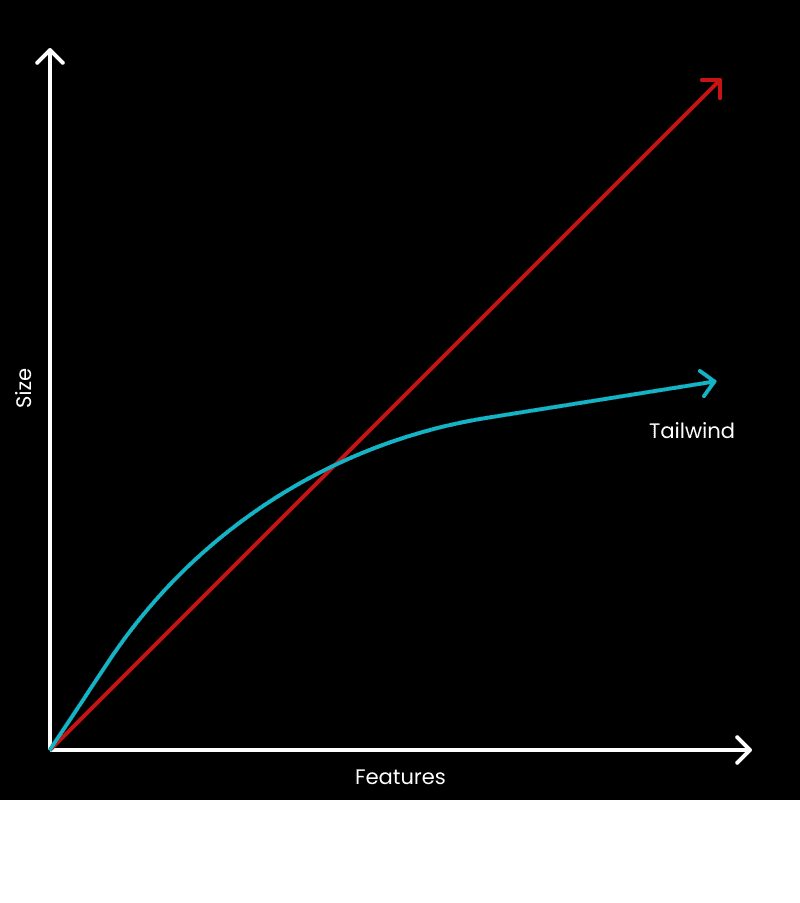

- Why  clean commit use Tailwind CSS as their primary framework
  collapsed:: true
	- problem : lack of standardisation of front end styling
	  collapsed:: true
		- used many like react, vue, laravel blade
		- sing multiple front-end frameworks and backend technologies complicates work when our devs switch from project to project. Additionally, some of our projects used different styling approaches. Jumping between styling approaches made it almost impossible to reuse visual components between projects.
		- With Tailwind, we've been able to standardise CSS across all of our projects. Sticking to a consistent approach makes it easier to code at a constant pace, grow our front-end team's know-how and achieve visual bug-free outcomes quickly and reliably. It's also significantly easier to reuse components across different projects, even when using different front-end frameworks.
		-
	- the way they worked before tailwind
	  collapsed:: true
		- bootstrap ui components
		- custom BEM classes. Bot hard to modify for custom needs
		-
	- switch was hard because of tendedncy to stick with existing
	- Switch to tailiwiind
		- uninutitive at first
			- when to use tw and when custom classes ?
			- The best method to encourage devs to use Tailwind classes was debugging fully tailwind written code bases. Despite more complex markup, it's much easier and faster to debug styling issues when only Tailwind classes are used.
			- Armed with the knowledge that debugging existing projects will be easier, the team became much more receptive to the idea of fully committing to Tailwind.
	- why they love tailwind
		- framework can be aapplied to any js stack
		- design team uses tailwind as guideline
	- drawbacks of tailwind
		- ugly code
		- initial drop in productivity
			- reverses over time
		-
- [why u shd use tailwind for next project](https://dev.to/joserfelix/why-use-tailwind-css-for-your-next-project-39hp)
  collapsed:: true
	- I started with CSS, moved to SCSS, and then moved to Styled Components. Throughout my journey, I had a lot of great experiences with each technology, however, none brought me the satisfaction and productivity boost that Tailwind has.
	- Styled Components is my go-to whenever I cannot use Tailwind in a project. It is such an amazing library since it allows me to have all my styles exactly where they need to be used. Also, it makes the app use only the styles it needs, instead of importing all styles on each page
	  collapsed:: true
		- it still had a problem: repetition. I felt I was writing the same rules over and over, and losing needed time. Also, My styles just kept getting bigger and bigger. When I realized this and found Tailwind, I chose to move on and I have never looked back since.
		-
	- stntax of tailwindis very basic
	  collapsed:: true
		- : append to HTML or JSX elements class names that represent one or more CSS declarations. Here is what it looks like:
		- This paradigm is called utility-first. It consists of building complex components from a constrained set of primitive utilities.
		-
	- smaller styles
	  collapsed:: true
		- The first benefit of using Tailwind is writing CSS that does not grow linearly. By having utility class names that will be shared between elements, it guarantees a consistent bundle size. Furthermore, Tailwind paired with Purge CSS will remove any unused styles so the codebase will not be bloated with extra classes.
		- 
		-
	- less cognititve load
	  collapsed:: true
		- asier to separate a site's elements into smaller components and not pollute the codebase with objects or extraneous CSS classes. Furthermore, every class is inlined in the component, making it much easier to read and understand.
		- Tailwind on the get-go consumes a lot less space. Also, its styles can be understood right away since they are read at the same time the developer scans the code. One does not have to jump over the file just to see its styles.
		- In this small example, it may not be obvious how cumbersome this can become in larger files. But on large codebases with multiple components per file, it is a nightmare to have all these separate styles between components. It takes a lot more time compared to Tailwind to understand how each element composes a UI.
		-
	- better composition
	  collapsed:: true
		- Tailwind by default makes the developer think in components. It makes us want to keep it small and avoid repeatability. This is possible thanks to the low amount of space it requires to achieve a layout; how it makes us notice when styles are repeated or bloated; and how easy it is to read and remember styles when split into small components.
		- Think of this practice as creating CSS class names for every feature or section of a website. Instead of doing it in terms of CSS, we would do it for HTML. For example, If we have a Hero, then it will be best to have a component that represents the Hero section. Likewise, we could do the same with blog postcards, navigation, header, etc.
		-
	- faster coding
	  collapsed:: true
		-
	- Another of Tailwind's weakness is creating complex animations. Even though simple animations are included out-of-the-box and more can be added through the configuration, complex animation orchestrations are very hard to achieve.
	  collapsed:: true
		- For creating a complex animation, one would have to create a class name for each element. This will end up in more work than doing within CSS. Thankfully, this can also be easily solved using Plain CSS through stylesheets, an animation library like Framer Motion, or a CSS-in-JS library like Styled Components. I believe any of these is valid and encouraged with Tailwind, however, some developers would just prefer to just use plain CSS for their animation without any library.
		-
	- Another weakness is the need to learn an opinionated naming convention. This is a double-edged sword. On one hand, having opinionated styles means once learned, knowledge is transferable between projects and productivity greatly increases. On the other hand, one has to dedicate time to learn all nuances and how it works before being able to create something useful.
		- n my opinion, if one knows CSS, the Tailwind naming convention will be very easy to learn since its class names are very similar to plain CSS. Also, their proprietary extension provides autocomplete so that developers can ease in when learning or remembering class names.
		-
- Tailwind map from api docs
	- ideally , you should start by veiwing a roadmap when learning new
		- not exitst _> u r a dev. build
		- docs always apply